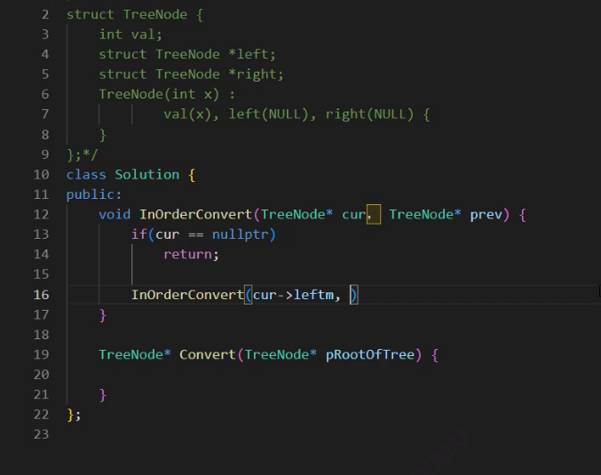

# 二叉搜索树

## CORE_CODE

```cpp
#include<iostream>
using namespace std;

template<class K>
struct BSTNode
{
	BSTNode* _left;
	BSTNode* _right;
	K _key;

	BSTNode(const K&key)
		:_left(nullptr)
		,_right(nullptr)
		,_key(key)
	{}
};

template<class K>
class BSTree
{
	typedef BSTNode<K> Node;
public:
	bool Insert(const K& key)
	{
		if (_root == nullptr)
		{
			_root = new Node(key);
		}
		Node* Parent = _root;
		Node* tmp = _root;
		while (tmp)
		{
			if (tmp->_key > key)
			{
				Parent = tmp;
				tmp = tmp->_left;
			}
			else if (tmp->_key < key)
			{
				Parent = tmp;
				tmp = tmp->_right;

			}
			else
			{
				return false;
			}
		}
		tmp = new Node(key);
		if (Parent->_key > key)
		{
			Parent->_left = tmp;
		}
		else
		{
			Parent->_right = tmp;
		}
		return true;
	}
	void InOrder()
	{
		_InOrder(_root);
		cout << endl;
	}
	bool Find(const K& key)
	{
		Node* cur = _root;
		while (cur)
		{
			if (cur->_key < key)
			{
				cur = cur->_right;
			}
			else if (cur->_key > key)
			{
				cur = cur->_left;
			}
			else
			{
				return true;
			}
		}
		return false;
	}
	bool Erase(const K& key)
	{
		Node* parent = nullptr;
		Node* cur = _root;
		while (cur)
		{
			if (cur->_key < key)
			{
				parent = cur;
				cur = cur->_right;
			}
			else if (cur->_key > key)
			{
				parent = cur;
				cur = cur->_left;
			}
			else
			{
				if (cur->_left == nullptr)
				{
					if (cur == _root)
					{
						_root = _root->_right;
					}
					else
					{
					if (parent->_left == cur)
						parent->_left = cur->_right;
					else
						parent->_right = cur->_right;
					}
					delete cur;
				}
				else if (cur->_right == nullptr)
				{
					if (cur == _root)
					{
						_root = _root->_left;
					}
					else
					{
						if (parent->_right == cur)
							parent->_right = cur->_left;
						else
							parent->_left = cur->_left;
					}
					delete cur;
				}
				else
				{
					Node* parent = cur;
					Node* subleft = cur->_right;
					while (subleft->_left)
					{
						parent = subleft;
						subleft = subleft->_left;
					}
					swap(cur->_key, subleft->_key);
					if (parent->_left == subleft)
						parent->_left = subleft->_right;
					else
						parent->_right = subleft->_right;
					delete subleft;
				}
				return true;
			}


		}
		return false;


	}
	bool FindR(const K& key)
	{
		return _FindR(_root, key);
	}
	bool InsertR(const K& key)
	{
		return _InsertR(_root, key);
	}
	bool EraseR(const K& key)
	{
		return _EraseR(_root, key);
	}
private:
	void _InOrder(Node*root)
	{
		if (root == nullptr)
			return;
		_InOrder(root->_left);
		cout << root->_key << " ";
		_InOrder(root->_right);
	}
	bool _FindR(Node* root, const K& key)
	{
		if (root == nullptr)
		{
			return false;
		}
		if (root->_key < key)
		{
			return _FindR(root->_right, key);
		}
		else if (root->_key > key)
		{
			return _FindR(root->_left, key);
		}
		else
		{
			return true;
		}
	}
	bool _InsertR(Node*& root, const K& key)//别名点睛之笔
	{
		if (root == nullptr)
		{
			root =new Node(key);
			return true;
		}
		else
		{
			if (root->_key < key)
			{
				return _InsertR(root->_right, key);
			}
			else if (root->_key > key)
			{
				return _InsertR(root->_left, key);
			}
			else
			{
				return false;
			}
		}
	}
	bool _EraseR(Node*& root, const K& key)
	{
		if (root == nullptr)
		{
			return false;
		}
		if (root->_key < key)
		{
			return _EraseR(root->_right, key);
		}
		else if (root->_key > key)
		{
			return _EraseR(root->_left, key);
		}
		else
		{
			if (root->_left == nullptr)
			{
				Node* del = root;
				root = root->_right;
				delete del;
				return true;
			}
			else if(root->_right ==nullptr)
			{
				Node* del = root;
				root = root->_left;
				delete del;
				return true;
			}
			else
			{
				Node* subLeft = root->_right;
				while (subLeft->_left)
				{
					subLeft = subLeft->_left;
				}

				swap(root->_key, subLeft->_key);

				// 转换成在子树去递归删除
				return _EraseR(root->_right, key);
			}
		}
	}
private:
	Node* _root = nullptr;
};
```


## 核心思想
### 查找
从根开始比较，比根大往右边查找，比跟小往左边查找，若是走到空，则说明不存在
### 插入
树为空，则直接new一个节点给root
树不为空，则直接搜索，找到空位进行插入
相同的不要，二叉搜索树中无相同元素
### 删除
**删除节点无左孩子/右孩子，但至少有一个节点**
找到当前节点，保留父亲节点，将父亲节点的左/右孩子节点（为空的那一边）指向删除节点的下一节点
**删除节点两个孩子都有**
第一种方法：找到当前节点的右子树的最左边的节点，并记录下最左节点的父亲节点，并将右子树的根节点的键值与最左边节点的键值进行交换，交换后将替代节点删除，并将其父亲节点指向替代删除节点的下一节点
### 析构函数
```cpp
~Destroy()
{
    Destroy(_root);
}
void Destroy(Node*&root)
{
    if(root == nullptr)
    return ;
    Destroy(root->left);
    Destroy(root->left);
    delete root;
    root = nullptr;
}
```

### 拷贝构造
根、左、右地拷贝

```cpp
Node*copy(Node*root)
{
    if(root == nullptr)
    {
        return nullptr;
    }
    Node* newroot = new Node(root->_key);
    newroot->_left = copy(root->_left);
    newroot->_right = copy(root->_right);
    return newnode;
}
BSTree(const BSTree<K>& t)
{
    _root = k.copy(t._root);
}
BSTree() = default;//强制生成默认的

```
### 赋值
```cpp
BSTree<K>& operator=(const BSTree<k>&t)
{
    swap(_root,t._root);
    return *this;
}

```


## 算法分析
### find时间复杂度
满二叉树->O(logn)
单边树->O(n)
**解决方案：**AVL树、红黑树，让树的节点分布尽量均衡一下

## 应用场景
### key的搜索模型
确定一个值在不在，如门禁key的搜索模型
### key/value模型
通过key查找value
如字典 
#### 代码
```cpp
#include<iostream>
using namespace std;

template<class K,class V>
struct BSTNode
{
	BSTNode<K,V>* _left;
	BSTNode<K,V>* _right;
	K _key;
    v _value;
	BSTNode(const K&key,const V&value)
		:_left(nullptr)
		,_right(nullptr)
		,_key(key)
        ,_value(value)
	{}
};


```

## 二叉树的相关题目
### 根据二叉树创建字符串
https://leetcode.cn/problems/construct-string-from-binary-tree/description/

二叉树的前序遍历，对子树加括号，但是空的括号要进行省略掉
左右为空可以省略，右为空可以省，作为空不能省，这样就不能够区分了
```cpp
//走前序遍历
string tree2str(TreeNode* root)
{
    string str;
    if(root == nullptr)
    return str;    
    str+= to_string(root->_val);
    if(root->_left||root->_right)
    {
        str+='(';
        str+= tree2str(root->_left);
        str+=')';
    }

    if(root->_right)
    {
        str+='(';
        str+= tree2str(root->_right);
        str+=')';
    }
}
```

### 二叉树的层序遍历
https://leetcode.cn/problems/binary-tree-level-order-traversal/description/


### 找公共祖先
https://leetcode.cn/problems/lowest-common-ancestor-of-a-binary-tree/description/

思路一：
分成三种情况：
第一种，一个在左一个在右，直接返回根节点
第二种和第三种，都在左或者都在右，那么久递归直到一个在左一个在右
每次都需要去寻找一次pq是在左还是右

 
极端情况下的时间复杂度是n的平法

思路二：
找到路径：递归算法走前序遍历，查找路径，不是就入栈，找到了也入栈（如果左右两边都没有的话需要pop）就返回false，然后

然后让大的先走


### 二叉搜索树与双向链表
https://www.nowcoder.com/practice/947f6eb80d944a84850b0538bf0ec3a5?tpId=13&&tqId=11179&rp=1&ru=/activity/oj&qru=/ta/coding-interviews/question-ranking

难点在于直接在树上动刀子
将当前节点的左指向pre
将pre的右指向当前节点


本质是一个线索化，实践中意义不大
怎么找头：转换前：找到最左节点；转换后：一样的向左进行寻找，找到空就是头节点

### 从前序与中序遍历序列构造二叉树
https://leetcode.cn/problems/construct-binary-tree-from-preorder-and-inorder-traversal/description/


本质：前序确定根，中序确定左右子树


### 二叉树前序遍历，非递归版本
https://leetcode.cn/problems/binary-tree-preorder-traversal/description/

左路节点是首先被访问的，然后剩下左路节点的右子树
每一棵子树都拆分为左路节点和左路节点的右子树：

用一个vector存取相应的值
用一个stack存储左路节点
每次区头部并且pop
cur不为空或者栈不为空就继续


### 二叉树中序遍历，非递归版本
https://leetcode.cn/problems/binary-tree-inorder-traversal/description/
```cpp
/**
 * Definition for a binary tree node.
 * struct TreeNode {
 *     int val;
 *     TreeNode *left;
 *     TreeNode *right;
 *     TreeNode() : val(0), left(nullptr), right(nullptr) {}
 *     TreeNode(int x) : val(x), left(nullptr), right(nullptr) {}
 *     TreeNode(int x, TreeNode *left, TreeNode *right) : val(x), left(left), right(right) {}
 * };
 */
class Solution {
public:
    vector<int> inorderTraversal(TreeNode* root) {
        vector<int> v;
        stack<TreeNode*> N;
        TreeNode* cur = root;
        while(cur||!N.empty())
        {
            while(cur)
            {
                N.push(cur);
                cur = cur->left;
            }
            TreeNode*TOP = N.top();            
            v.push_back(TOP->val);
            N.pop();
            cur = TOP->right;
        }
        return v;
    }
};
```

### 二叉树后序遍历，非递归版本
https://leetcode.cn/problems/binary-tree-postorder-traversal/description/
方式一：对每个节点增加flag，使用栈的数据结构
方式二：使用一个PREV记录上一个访问的节点，如果上一个访问的节点是自己的右节点或者为空，那么本节点就可以访问


