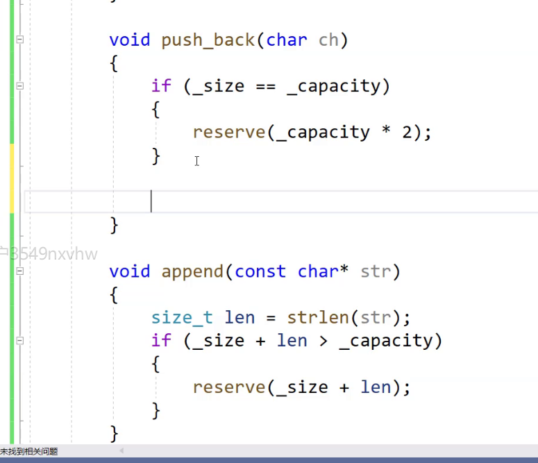
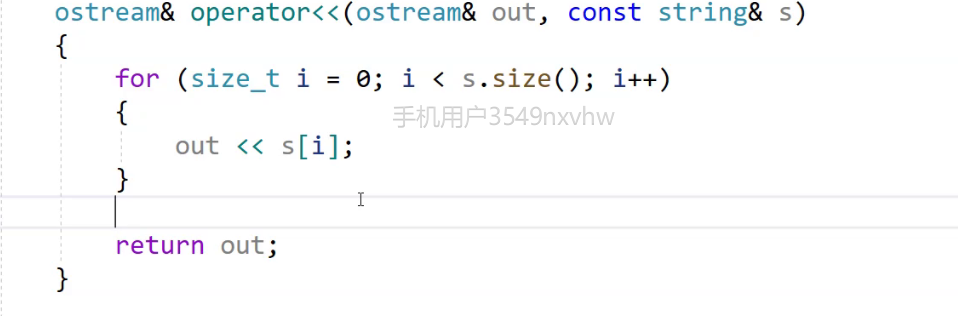

# String类
string属于标准库的类，用于管理字符数组
string也是一个泛型
他的模板是basic_string
## 学习的原因

### 使用
#### 遍历方式
1、下标索引
2、迭代器
```cpp
string::iterator it = s1.begin()
这里使用的话需要解引用，类似于指针的用法
```
3、范围for
for(auto& ch:s)
#### 扩容
第一次两倍，之后都是1.5倍：vs下的版本，不同版本下的c++编译器的底层原理可能不一样，比如linux下的g++就是两倍两倍的扩容

#### reserve
提前开空间,保留空间,不过在vs里面会多开一点空间,看有没有零钱
在g++下就只会给需要的
```cpp

string x;

x.reserve(100);
//提前保留一个100字节的空间
```
价值在于能够确定大概需要多少空间，提前开好空间，减少扩容，提高效率
一般来说，当这个string类空间已经开出来后，无法通过reserve缩小空间

#### resize//用的不多，顺序结构保持一定性
void resize (size_t n);没给的话默认填充/0
void resize (size_t n, char c);
两个版本，进行更改一个string 的长度
char c是给填充值，如果说更改的长度大于capacity，就会扩容，如果小于现在的size就会删除比resize大的之后的字符

可以用来进行开空间初始化hh
s.resize(12,'x');


#### at
一个普通函数，越界后会抛出异常，而[]会直接结束程序
使用：s1.at(0) = 'a';


#### push_back&append 尾插
在字符串后面插入一个字符
s.push_back('+');


#### += 常用 尾插
s+='s';

#### + 一个全局函数
s+'s'这样直接使用
不过代价很大，会有拷贝构造

#### assign
一个变相的赋值，若原来有值会直接覆盖掉，可以指定赋值的区间

#### insert 在某位置插入
尽量少用
string (1)	
 string& insert (size_t pos, const string& str);
substring (2)	
 string& insert (size_t pos, const string& str, size_t subpos, size_t sublen);
c-string (3)	
 string& insert (size_t pos, const char* s);
buffer (4)	
 string& insert (size_t pos, const char* s, size_t n);
fill (5)	
 string& insert (size_t pos, size_t n, char c);
    void insert (iterator p, size_t n, char c);
single character (6)	
iterator insert (iterator p, char c);
range (7)	
template <class InputIterator>
   void insert (iterator p, InputIterator first, InputIterator last);
   	
    
使用 str.insert(0, 1, 'x');


#### erase 尽量少用
	str.erase(3);//往后全部删没了

sequence (1)	
 string& erase (size_t pos = 0, size_t len = npos);//指定删多少


#### replace 从n开始的m个字符替换成str/char
str.replace(2, 2, "3123");日常使用很少，需要使用去查一下文档即可，会涉及到挪动位置，效率较低
#### swap
比起算法中的代价小很多，这里只是字符串指针指向改变
而标准库中swap是深拷贝调用
不过库也写了一个专门给string的swap防止你去调用代价高的

#### find系列
.find('x')去找x，返回值为size_t,指的是字符的位置
.rfind('x')从后面开始找x
string s2 = s1.substr(i)取这个字符开始一直到结束的地方，当然可以加参数，表示读取几个
主要看多少到多少如果说在前面的话：
s2 = s1.substr(0,j);
如果说找不到的话，会返回npos

##### find_first_of("zxxxx")
找到中间的任意一个字符进行统一的操作

##### find_last_of("Dada")
从后向前找当中的任意一个字符进行操作，相当于一批都要进行操作

#### getline
Extracts characters from is and stores them into str until the delimitation character delim is found (or the newline character, '\n'
getline(cin,str(string),'指定')
## OJ题

```cpp
#include<iostream>
#include<string.h>
using namespace std;
class Solution {
public:
    bool isletter(char s)
    {
        if (s >= 'A' && s <= 'Z')
        {
            return true;
        }
        else if (s >= 'a' && s <= 'z')
        {
            return true;
        }
        else
            return false;
    }

    string reverseOnlyLetters(string s) {
        int begin = 0;
        int end = s.size() - 1;
        while (begin < end)
        {
            while (begin < end && !isletter(s[begin]))
            {
                begin++;
            }
            while (begin < end && !isletter(s[end]))
            {
                end--;
            }
            swap(s[begin], s[end]);
            begin++;
            end--;
        }
        return s;
    }
};
int main()
{
    Solution s;
    string sentence = "dasdsaad";
    cout << s.reverseOnlyLetters(sentence) << endl;
    return 0;
}
```


## 大数运算


//每次尾插，最后逆置也行


## string模拟实现
编码表：值和符号映射的表
utf-8、utf-16、utf-32
用不同的字节进行表示汉字，节省空间
string->utf-8;
u16string->utf-16;
u32string->utf-32;

模板参数不同
乱码就是值和编码表没有统一起来


### 针对char的string类
```cpp
    class string
    {
    public:
        string(const char*str = "")
            :_size(strlen(str))
            ,_capacity(_size)
        {
            _str = new char[_capacity+1];
            strcpy(_str,,str)
        }
        size_t capacity() const
        {

            return _capacity
        }
        typedef char* iterator;

        ~string()
        {
            delete[] _str;
            _str = nullptr;
            _size=_capacity = 0;
        }        
    private:
        char* _str;
        size_t _size;
        size_t _capacity;
        //初始化顺序是按照声明的顺序进行的
    }
```



const 静态的整形可以在类中进行初始化，but非const不行，属于特例

不过这里end>=pos会有问题，因为其是一种整型提升，类型不同，所以会使end=-1；一种是将pos强行转换类型

或者：


```cpp
bool operator<(const string&s1)
{
    return strcmp() 
}
bool operator==(const string&s1,const string&s1)

```




并且需要清理以下，不然也会有bug

//类中随意访问自己的私有

数据存在对象中需要深拷贝
而对象存在指向的空间之中则不需要深拷贝，浅拷贝即可


### string的一些底层原理
未初始化的string的capacity的大小是15
总的大小是28
类对象中的私有成员会有_buff[16]\_str\_size\_capacity;
小于16就在buff数组中，大于等于16存在_str指向的空间
这样可以避免一些空间碎片的问题

#### Linux下g++：引用计数的写实拷贝->延时拷贝
拷贝的时候要++引用计数
析构的时候要--引用计数，引用计数减到0时，说明是最后一个对象，然后析构
两个指针指向一块空间，但是是写时拷贝，写的时候再进行拷贝
string对象只占4/8个字节，指向一个堆空间

#### Windows下vs：直接深拷贝

#### 字符串的bm算法