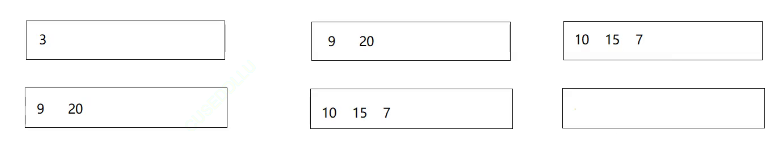
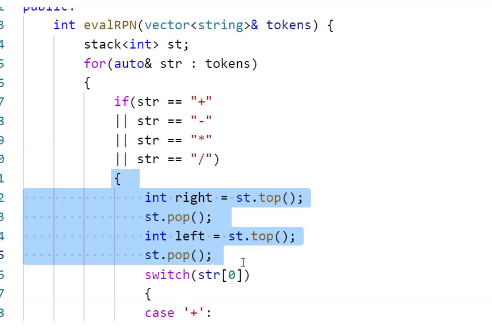

# 模板性质

栈和队列是让其他容器管理数据，所以有一个容器适配器


# 使用


# OJ
## 最小栈
设计一个支持 push ，pop ，top 操作，并能在常数时间内检索到最小元素的栈。

实现 MinStack 类:

MinStack() 初始化堆栈对象。
void push(int val) 将元素val推入堆栈。
void pop() 删除堆栈顶部的元素。
int top() 获取堆栈顶部的元素。
int getMin() 获取堆栈中的最小元素。

### 思路
空间换时间，开辟两个栈，第二个栈在第一个栈入到小于等于当前最小的的时候压栈，第一个栈出栈的时候当且仅当出栈元素等于第二个栈栈顶元素时，第二个栈才出栈

构造函数不写或者写了没用就会调用初始化列表，内置类型就会调用默认构造函数


## 栈的压入、弹出序列
输入两个整数序列，第一个序列表示栈的压入顺序，请判断第二个序列是否可能为该栈的弹出顺序。假设压入栈的所有数字均不相等。例如序列1,2,3,4,5是某栈的压入顺序，序列4,5,3,2,1是该压栈序列对应的一个弹出序列，但4,3,5,1,2就不可能是该压栈序列的弹出序列。
1. 0<=pushV.length == popV.length <=1000
2. -1000<=pushV[i]<=1000
3. pushV 的所有数字均不相同

### 思路
模拟出栈入栈的过程
先按照入栈顺序进行入栈，入栈序列先入栈，栈顶数据与出栈序，出栈序列++，出战顶元素，继续比较，直到栈为空或者不匹配
如果不匹配重复上述过程吗，
结束条件：入栈序列走完，
判断条件：出栈队列是否走完/入栈队列是否为空

## 二叉树的层序遍历
一层换一行，返回一个二维数组
难点在于如何区分数值的层级划分
https://leetcode.cn/problems/binary-tree-level-order-traversal/description/
### 思路
1.双队列
一个队列存数据，另外一个队列存层级，孩子所在的层级是其父亲的层级+1；

2.两个vector
clear+swap

3.使用level_size对每层的数据个数进行记录
首先root肯定是1，出完一层后，队列的size就是下一层的个数
然后将其赋值给level_size即可
每一层使用一个循环进行控制


## 逆波兰表达式求值
https://leetcode.cn/problems/evaluate-reverse-polish-notation/description/
即后缀表达式，这样就是按优先级进行排列的
操作数入栈，如遇操作数，则取出栈顶的两个操作数进行运算，运算结果再入栈，最后栈里只剩下结果
运算的优先级，由相邻的两个操作符进行决定
### 中缀转后缀
1、操作数输出
2、操作符
1.栈为空，入栈
2.如果不为空，与栈顶操作符进行比较，优先级比栈顶操作符高，入栈
3.如果优先级是小于或者等于的那就出栈顶，然后用这个操作符进行下一次与栈顶操作符比较
3、出栈里所有的运算符
**如果有括号**
那就在括号开始的时候进行递归，新开一个栈，然后将结果返回


### 思路&代码

```cpp
namespace hh
{
    template<class T,class Container>
    class stack
    {
        public


    };
}


```
# 模拟实现


可以直接用方括号进行初始化，这是c++11中的特性
通过适配器，可以做到通过模板参数控制底层进行变化，而上层变化不大

## 库

适配器这里给了一个deque，这里用的是一个双端队列，就是一个普通的容器，没有队列的性质，他所能进行的操作是兼顾list和vector的，，但是效率等方面并没有list和vector中的一些方面高

### deque
原理：开辟多个子数组和一个中控数组，中控数组本身是一个指针数组，指针从中控数组的中间开始存贮，每一个指针指向一个buffer，也就是子数组，中间没有扩容的过程，每次满了就开辟一块新的空间，不需要挪动数据

也会存在扩容的场景，但是扩容代价很低

**中间位置插入或者删除**
如果每个buff都是一样大的，那么[]就会快很多
假设每个buff大小都是10
i-=第一个buff数据个数
x = i/10就能算出第几个buff
y%=10就是这个buff的第几个
如果每个大小不一样
buff的[]就不一样了
大多数的实现都会让[]的效率较高


