# AVL树
二叉搜索树有其自身的缺陷，假如往树中插入的元素有序或者接近有序，二叉搜索树就会退化成单支树，时间复杂度会退化成O(N)，因此map、set等关联式容器的底层结构是对二叉树进行了平衡处理，即采用平衡树来实现。要求左右高度差不超过1.

当向二叉搜索树中插入新结点后，如果能保证每个结点的左右子树高度之差的绝对值不超过1(需要对树中的结点进行调整)，即可降低树的高度，从而减少平均搜索长度。

平衡因子：右树-左树的高度，平衡因子是一种实现方式

最终可以变成logN

## 定义
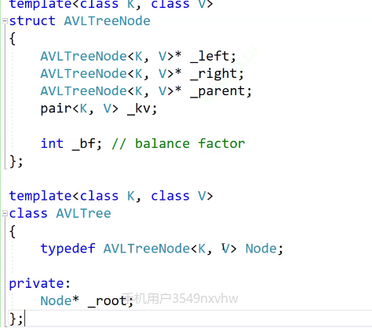
## insert
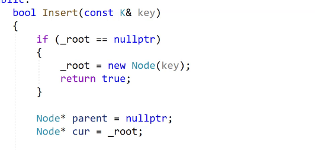
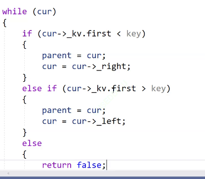
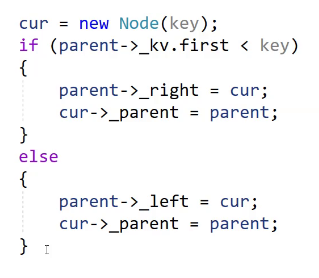
前面的key改为pair
以上插入完成，后面开始管控平衡
插入在左边，父亲的平衡因子--，插入在右边，父亲的平衡因子++，新增节点可能会影响祖先，但是不会影响旁支
如果子树高度不变，就不会继续往上影响祖先
如果子树高度变化，就会继续往上影响祖先
虽然子树高度发生变化会影响祖先，但是没有必要对parent之上的祖先进行平衡因子更改，因为此时就需要对子树进行更改

首先需要对平衡因子进行更新
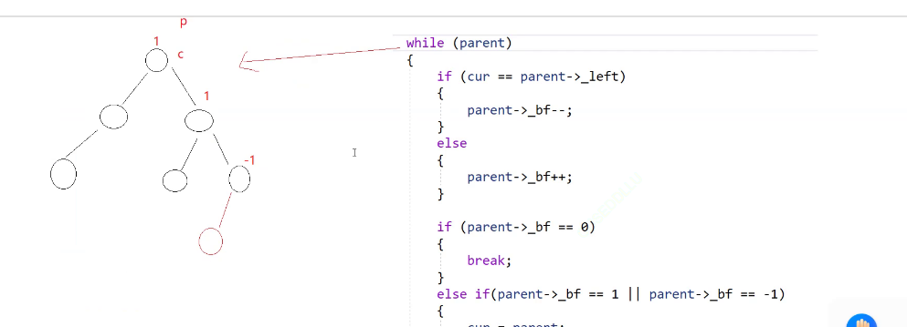
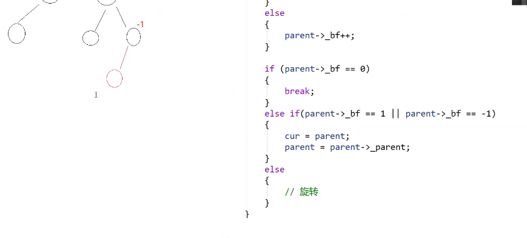
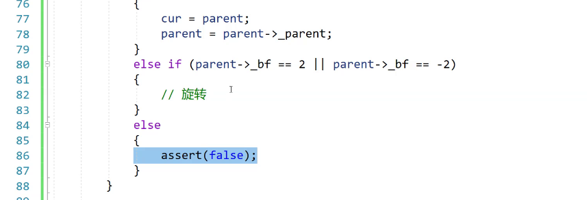

之后就开始对树进行旋转
旋转需要使左右均衡一点
并且需要保持搜索树的规则
举例子：
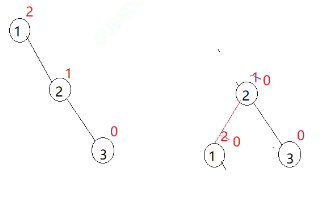
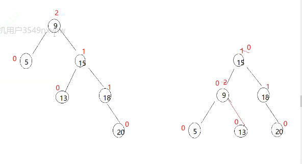
### 抽象出模型：
#### 左单旋
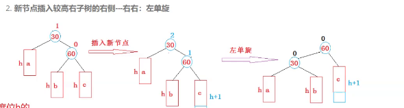
总结左单旋的特点：
b变成30的左边，30（根节点）变成60的左边
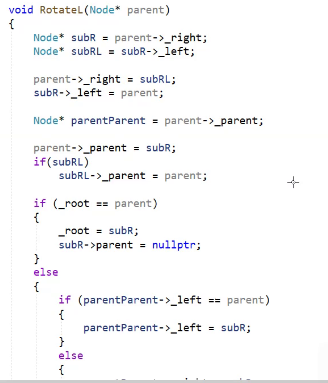
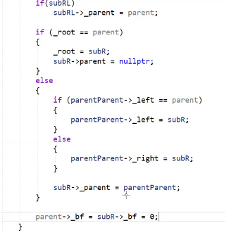
右单旋：
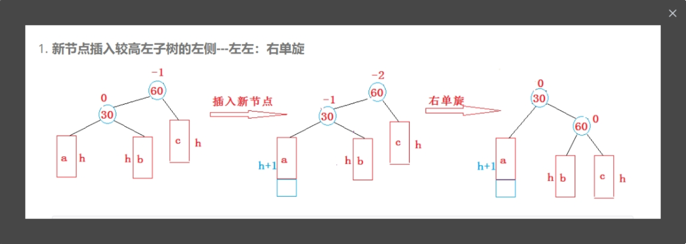
