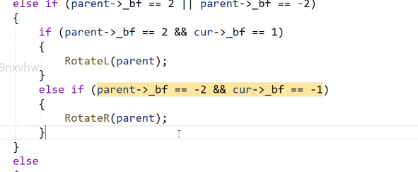
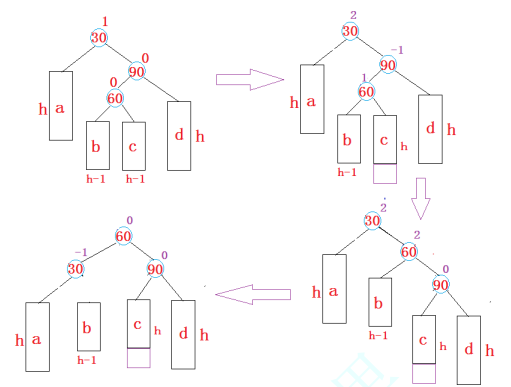
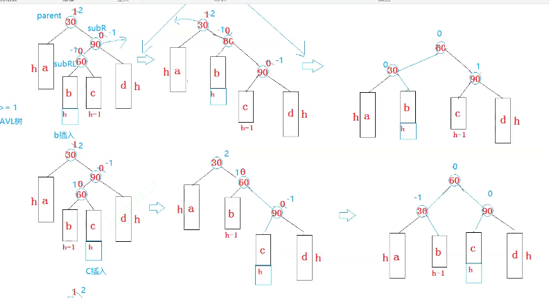
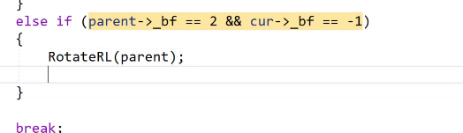
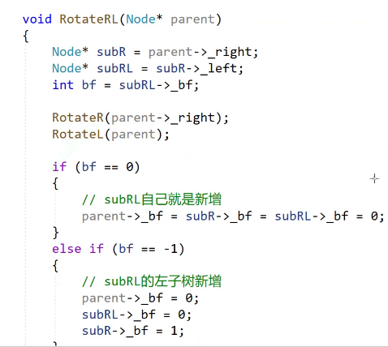
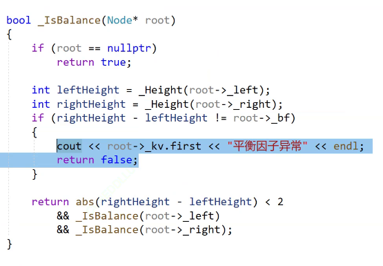
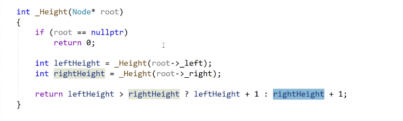
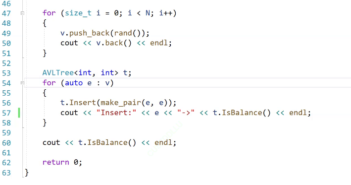

# AVL树
二叉搜索树有其自身的缺陷，假如往树中插入的元素有序或者接近有序，二叉搜索树就会退化成单支树，时间复杂度会退化成O(N)，因此map、set等关联式容器的底层结构是对二叉树进行了平衡处理，即采用平衡树来实现。要求左右高度差不超过1.

当向二叉搜索树中插入新结点后，如果能保证每个结点的左右子树高度之差的绝对值不超过1(需要对树中的结点进行调整)，即可降低树的高度，从而减少平均搜索长度。

平衡因子：右树-左树的高度，平衡因子是一种实现方式

最终可以变成logN

## 定义

## insert


前面的key改为pair

以上插入完成，后面开始管控平衡
插入在左边，父亲的平衡因子--，插入在右边，父亲的平衡因子++，新增节点可能会影响祖先，但是不会影响旁支
如果子树高度不变，就不会继续往上影响祖先
如果子树高度变化，就会继续往上影响祖先
虽然子树高度发生变化会影响祖先，但是没有必要对parent之上的祖先进行平衡因子更改，因为此时就需要对子树进行更改

首先需要对平衡因子进行更新


### 之后就开始对树进行旋转
parent = 2 cur = 1;左单旋
parent = -2 ,cur = -1;右单旋
左左增右单旋
右右增左单旋

#### 抽象出模型：
##### 左单旋

总结左单旋的特点：
b变成30的左边，30（根节点）变成60的左边


##### 右单旋：

##### 双旋->先左后右

##### 双旋->先右后左
将刚刚的b拆解：

a和d是高度为h的AVL树
b和c是高度为h-1的AVL树或者空树
30看下来是右边高，90看下来是左边高
**操作：**
1.以90为旋转点进行右单旋
先对局部进行处理，变为纯粹的右边高
2.以30为旋转点进行左单旋


60的平衡因子可以决定后序的平衡因子的更改

旋转使树平衡了
并且旋转降低了这棵子树的高度，恢复到跟之前的高度

## 检查

查询自己左右子树的高度差





## 完整代码
```cpp
#pragma once
template<class K ,class V>
struct AVLTreeNode
{
	AVLTreeNode<K, V>* _left;
	AVLTreeNode<K, V>* _right;
	AVLTreeNode<K, V>* _parent;
	pair<K, V> _kv;
	int _bf;
	AVLTreeNode(const pair<K,V> kv)
		:_kv(kv)
		,_left(nullptr)
		,_right(nullptr)
		,_parent(nullptr)
		,_bf(0)
	{}
};


template<class K, class V>
class AVLtree
{
public:
	typedef AVLTreeNode<K, V> Node;


	void RotateL(Node* parent)
	{
		Node* SubR = parent->_right;
		Node* SubRL = SubR->_left;
		parent->_right = SubRL;
		SubR->_left = parent;
		Node* pparent = parent->_parent;
		parent->_parent = SubR;
		if (SubRL)
		{
			SubRL->_parent = parent;
		}
		if (_root == parent)
		{
			_root = SubR;
			SubR->_parent = nullptr;
		}
		else
		{
			if(pparent->_right == parent)
			{
				pparent->_right = SubR;
			}
			else
			{
				pparent->_left = SubR;
			}
			SubR->_parent = pparent;
		}
		parent->_bf = SubR->_bf = 0;
	}

	void RotateR(Node* parent)
	{
		Node* SubL = parent->_left;
		Node* SubLR = SubL->_right;
		parent->_left = SubLR;
		Node* pparent = parent->_parent;
		parent->_parent = SubL;
		SubL->_right = parent;
		if (SubLR)
			SubLR->_parent = parent;
		if (_root == parent)
		{
			_root = SubL;
			SubL->_parent = nullptr;
		}
		else
		{
			if (pparent->_right == parent)
			{
				pparent->_right = SubL;
			}
			else
			{
				pparent->_left = SubL;
			}
			SubL->_parent = pparent;
		}
		parent->_bf = SubL->_bf = 0;
	}

	void RotateRL(Node* parent)
	{
		Node* SubR = parent->_right;
		Node* SubRL = SubR->_left;
		int bf = SubRL->_bf;
		RotateR(parent->_right);
		RotateL(parent);
		if (bf == 0)
		{
			SubR->_bf = SubRL->_bf = parent->_bf = 0;
		}
		else if(bf == 1)
		{
			parent->_bf = -1;
			SubRL->_bf = 0;
			SubR->_bf = 0;
		}
		else if (bf == -1)
		{
			parent->_bf = 0;
			SubRL->_bf = 0;
			SubR->_bf = 1;
		}
		else
		{
			assert(false);
		}
	}

	void RotateLR(Node* parent)
	{
		Node* SubL = parent->_left;
		Node* SubLR = SubL->_right;
		int bf = SubLR->_bf;
		RotateL(parent->_left);
		RotateR(parent);
		if (bf == 0)
		{
			SubL->_bf = SubLR->_bf = parent->_bf = 0;
		}
		else if (bf == 1)
		{
			parent->_bf = 0;
			SubLR->_bf = 0;
			SubL->_bf = -1;
		}
		else if (bf == -1)
		{
			parent->_bf = 0;
			SubLR->_bf = 1;
			SubL->_bf = 0;
		}
		else
		{
			assert(false);
		}
	}

	bool insert(const pair<K, V> kv)
	{
		if (_root == nullptr)
		{
			_root = new Node(kv);
			return true;
		}
		Node* parent = nullptr;
		Node* cur = _root;
		while (cur)
		{
			if (cur->_kv.first < kv.first)
			{
				parent = cur;
				cur = cur->_right;
			}
			else if (cur->_kv.first > kv.first)
			{
				parent = cur;
				cur = cur->_left;
			}
			else
			{
				return false;
			}
		}
			cur = new Node(kv);
			if (parent->_kv.first > cur->_kv.first)
			{
				parent->_left = cur;
				cur->_parent = parent;
			}
			else
			{
				parent->_right = cur;
				cur->_parent = parent;
			}
			while (parent)
			{
				if (cur == parent->_left)
				{
					parent->_bf--;
				}
				else
				{
					parent->_bf++;
				}
				if (parent->_bf == 0)
				{
					break;
				}
				else if (parent->_bf == 1 || parent->_bf == -1)
				{
					cur = parent;
					parent = parent->_parent;
				}
				else if(parent->_bf == 2 || parent->_bf == -2)
				{
					if (parent->_bf == 2 && cur->_bf == 1)
					{
						RotateL(parent);
					}
					else if (parent->_bf == -2 && cur->_bf == -1)
					{
						RotateR(parent);
					}
					else if (parent->_bf == 2 && cur->_bf == -1)
					{
						RotateRL(parent);
					}
					else if (parent->_bf == -2 && cur->_bf == 1)
					{
						RotateLR(parent);
					}
					break;
				}
			}

		return true;

	}
	void Inorder()
	{
		_Inorder(_root);
	}
	
	bool balance_test()
	{
		return _balance(_root);
	}
	
private:
	void _Inorder(Node*root)
	{
		if (root == nullptr)
		{
			return;
		}
		_Inorder(root->_left);
		cout<<root->_kv.first<<endl;
		_Inorder(root->_right);
	}

	int _Height(Node* root)
	{
		if (root == nullptr)
			return 0;
		int height_left = _Height(root->_left);
		int height_right = _Height(root->_right);
		return height_left > height_right ? height_left + 1 : height_right + 1;
	}

	bool _balance(Node* root)
	{
		if (root == nullptr)
		{
			return true;
		}
		int height_left = _Height(root->_left);
		int height_right = _Height(root->_right);
		if(height_right- height_left!=root->_bf) 
		{
			cout<<root->_kv.first<<"平衡因子异常" << endl;
			return false;
		}

		return abs(height_right - height_left) < 2 && _Height(root->_left) && _Height(root->_right);
	}

	Node* _root = nullptr;
};


```