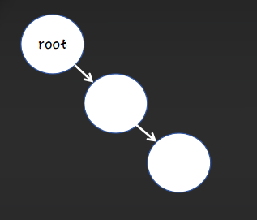
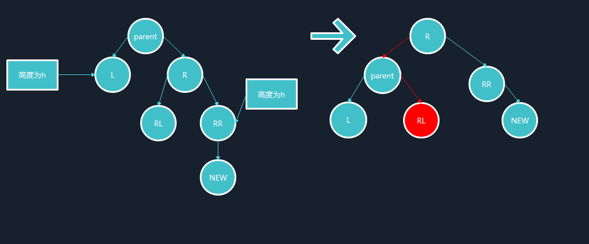
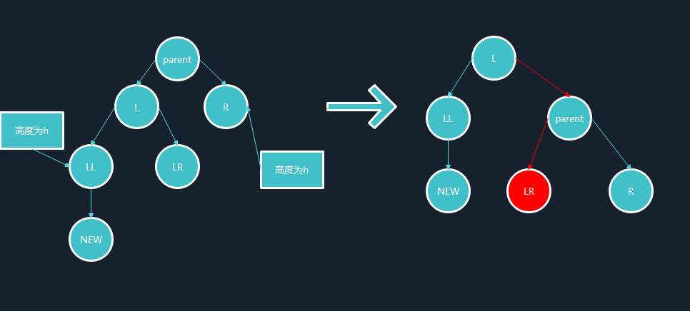
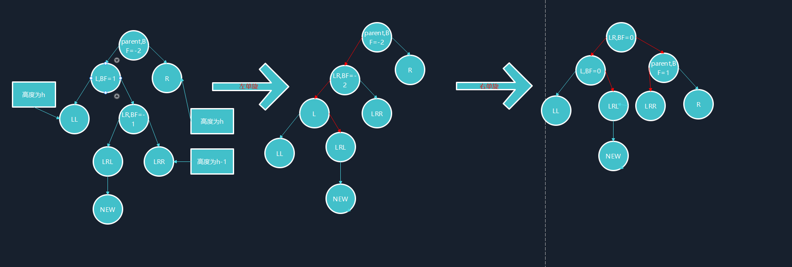
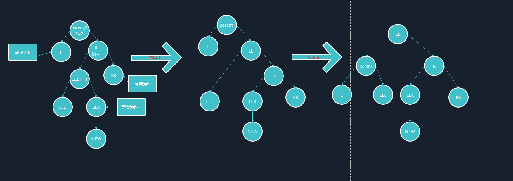

# 详解AVL树旋转调整过程
## 前言
AVL树，即平衡二叉树，是一种在搜索二叉树上进行改进的数据结构，搜索二叉树能够控制节点在树中位置的数据结构，能够做到建立数据的关联性。
对于单个元素搜索的一般场景下时间复杂度为$log_2N$,但是极端场景下：

搜索树的时间复杂度会退化到$O(log_2N)$
此时平衡二叉树被提出，能够在插入元素时动态地调整元素位置，使得二叉树的形状尽量“丰满”，达到左右子树较为平衡的状态，即**左右子树高度差不超过1**。

## 需要调整的四种状态
我们设置平衡因子bf对每个节点是否平衡进行判断，需要平衡的节点进行相应的操作，总结下来有四种情况需要进行调整。

### 左单旋
左单旋指的是在插入节点后parent的bf = 2,Cur的bf = 1的情况，具体来说，我们需要做的调整如下：

具体操作结合代码进行讲解：
#### 详细代码
```cpp
void RotateL(Node* parent)
	{
		Node* SubR = parent->_right;//记录主要调节节点
		Node* SubRL = SubR->_left;//记录主要调节节点
		parent->_right = SubRL;//连接操作
		SubR->_left = parent;//进行连接
		Node* pparent = parent->_parent;//改变子树根节点需要对该子树的父亲进行记录
		parent->_parent = SubR;//三叉树要记得对父亲节点进行记录
		if (SubRL)
		{
			SubRL->_parent = parent;//非空树进行连接
		}
		if (_root == parent)
		{
			_root = SubR;//若是根节点直接进行更改
			SubR->_parent = nullptr;
		}
		else//判断子树原根节点是其父亲节点的左孩子还是右孩子，对其进行连接
		{
			if(pparent->_right == parent)
			{
				pparent->_right = SubR;
			}
			else
			{
				pparent->_left = SubR;
			}
			SubR->_parent = pparent;
		}
		parent->_bf = SubR->_bf = 0;//修改平衡因子
	}
```

### 右单旋
右单旋指的是在插入节点后parent的bf = -2,Cur的bf = -1的情况，具体来说，我们需要做的调整如下：

#### 详细代码
```CPP
void RotateR(Node* parent)
	{
		Node* SubL = parent->_left;
		Node* SubLR = SubL->_right;//记录主要调节节点
		parent->_left = SubLR;
		Node* pparent = parent->_parent;
		parent->_parent = SubL;//改变子树根节点需要对该子树的父亲进行记录
		SubL->_right = parent;
		if (SubLR)
			SubLR->_parent = parent;//非空树进行连接
		}
		if (_root == parent)
		{
			_root = SubL;//根节点直接进行修改
			SubL->_parent = nullptr;
		}
		else//非根节点需要将子树根节点与其父亲进行连接
		{
			if (pparent->_right == parent)
			{
				pparent->_right = SubL;
			}
			else
			{
				pparent->_left = SubL;
			}
			SubL->_parent = pparent;
		}
		parent->_bf = SubL->_bf = 0;//修改平衡因子
	}
```

### 双旋->先左后右
双旋，也就是需要两次旋转才可以对树进行平衡，大体思路即对树进行两次旋转，先完成一个局部旋转，使整棵树的情况简单下来，再对整个数进行更改，先左后右实际上是新插入节点再较高左子树的右侧进行了插入，具体调整如下：

接下来结合代码进行具体讲解：
```cpp
void RotateLR(Node* parent)
	{
		Node* SubL = parent->_left;
		Node* SubLR = SubL->_right;
		int bf = SubLR->_bf;//记录
		RotateL(parent->_left);//复用代码
		RotateR(parent);
		if (bf == 0)//新增节点本身导致的不平衡，也就是原来为空的情况
		{
			SubL->_bf = SubLR->_bf = parent->_bf = 0;
		}
		else if (bf == 1)//插入节点右边高
		{
			parent->_bf = 0;
			SubLR->_bf = 0;
			SubL->_bf = -1;
		}
		else if (bf == -1)//插入节点左边高
		{
			parent->_bf = 0;
			SubLR->_bf = 1;
			SubL->_bf = 0;
		}
		else
		{
			assert(false);
		}
	}
```

### 双旋->先右后左
双旋的第二种情况就是再右边高的子树左边进行插入，具体操作如下：

接下来结合具体代码进行分析
#### 详细代码
```cpp
	void RotateRL(Node* parent)
	{
		Node* SubR = parent->_right;
		Node* SubRL = SubR->_left;
		int bf = SubRL->_bf;
		RotateR(parent->_right);
		RotateL(parent);
		if (bf == 0)
		{
			SubR->_bf = SubRL->_bf = parent->_bf = 0;
		}
		else if(bf == 1)
		{
			parent->_bf = -1;
			SubRL->_bf = 0;
			SubR->_bf = 0;
		}
		else if (bf == -1)
		{
			parent->_bf = 0;
			SubRL->_bf = 0;
			SubR->_bf = 1;
		}
		else
		{
			assert(false);
		}
	}
```
注：以上所示图的仅为编号，相对位置关系仅在初始状况中成立

## 完整测试代码
```cpp
#pragma once
template<class K ,class V>
struct AVLTreeNode
{
	AVLTreeNode<K, V>* _left;
	AVLTreeNode<K, V>* _right;
	AVLTreeNode<K, V>* _parent;
	pair<K, V> _kv;
	int _bf;
	AVLTreeNode(const pair<K,V> kv)
		:_kv(kv)
		,_left(nullptr)
		,_right(nullptr)
		,_parent(nullptr)
		,_bf(0)
	{}
};


template<class K, class V>
class AVLtree
{
public:
	typedef AVLTreeNode<K, V> Node;


	void RotateL(Node* parent)
	{
		Node* SubR = parent->_right;
		Node* SubRL = SubR->_left;
		parent->_right = SubRL;
		SubR->_left = parent;
		Node* pparent = parent->_parent;
		parent->_parent = SubR;
		if (SubRL)
		{
			SubRL->_parent = parent;
		}
		if (_root == parent)
		{
			_root = SubR;
			SubR->_parent = nullptr;
		}
		else
		{
			if(pparent->_right == parent)
			{
				pparent->_right = SubR;
			}
			else
			{
				pparent->_left = SubR;
			}
			SubR->_parent = pparent;
		}
		parent->_bf = SubR->_bf = 0;
	}

	void RotateR(Node* parent)
	{
		Node* SubL = parent->_left;
		Node* SubLR = SubL->_right;
		parent->_left = SubLR;
		Node* pparent = parent->_parent;
		parent->_parent = SubL;
		SubL->_right = parent;
		if (SubLR)
			SubLR->_parent = parent;
		if (_root == parent)
		{
			_root = SubL;
			SubL->_parent = nullptr;
		}
		else
		{
			if (pparent->_right == parent)
			{
				pparent->_right = SubL;
			}
			else
			{
				pparent->_left = SubL;
			}
			SubL->_parent = pparent;
		}
		parent->_bf = SubL->_bf = 0;
	}

	void RotateRL(Node* parent)
	{
		Node* SubR = parent->_right;
		Node* SubRL = SubR->_left;
		int bf = SubRL->_bf;
		RotateR(parent->_right);
		RotateL(parent);
		if (bf == 0)
		{
			SubR->_bf = SubRL->_bf = parent->_bf = 0;
		}
		else if(bf == 1)
		{
			parent->_bf = -1;
			SubRL->_bf = 0;
			SubR->_bf = 0;
		}
		else if (bf == -1)
		{
			parent->_bf = 0;
			SubRL->_bf = 0;
			SubR->_bf = 1;
		}
		else
		{
			assert(false);
		}
	}

	void RotateLR(Node* parent)
	{
		Node* SubL = parent->_left;
		Node* SubLR = SubL->_right;
		int bf = SubLR->_bf;
		RotateL(parent->_left);
		RotateR(parent);
		if (bf == 0)
		{
			SubL->_bf = SubLR->_bf = parent->_bf = 0;
		}
		else if (bf == 1)
		{
			parent->_bf = 0;
			SubLR->_bf = 0;
			SubL->_bf = -1;
		}
		else if (bf == -1)
		{
			parent->_bf = 0;
			SubLR->_bf = 1;
			SubL->_bf = 0;
		}
		else
		{
			assert(false);
		}
	}

	bool insert(const pair<K, V> kv)
	{
		if (_root == nullptr)
		{
			_root = new Node(kv);
			return true;
		}
		Node* parent = nullptr;
		Node* cur = _root;
		while (cur)
		{
			if (cur->_kv.first < kv.first)
			{
				parent = cur;
				cur = cur->_right;
			}
			else if (cur->_kv.first > kv.first)
			{
				parent = cur;
				cur = cur->_left;
			}
			else
			{
				return false;
			}
		}
			cur = new Node(kv);
			if (parent->_kv.first > cur->_kv.first)
			{
				parent->_left = cur;
				cur->_parent = parent;
			}
			else
			{
				parent->_right = cur;
				cur->_parent = parent;
			}
			while (parent)
			{
				if (cur == parent->_left)
				{
					parent->_bf--;
				}
				else
				{
					parent->_bf++;
				}
				if (parent->_bf == 0)
				{
					break;
				}
				else if (parent->_bf == 1 || parent->_bf == -1)
				{
					cur = parent;
					parent = parent->_parent;
				}
				else if(parent->_bf == 2 || parent->_bf == -2)
				{
					if (parent->_bf == 2 && cur->_bf == 1)
					{
						RotateL(parent);
					}
					else if (parent->_bf == -2 && cur->_bf == -1)
					{
						RotateR(parent);
					}
					else if (parent->_bf == 2 && cur->_bf == -1)
					{
						RotateRL(parent);
					}
					else if (parent->_bf == -2 && cur->_bf == 1)
					{
						RotateLR(parent);
					}
					break;
				}
			}

		return true;

	}
	void Inorder()
	{
		_Inorder(_root);
	}
	
	bool balance_test()
	{
		return _balance(_root);
	}
	
private:
	void _Inorder(Node*root)
	{
		if (root == nullptr)
		{
			return;
		}
		_Inorder(root->_left);
		cout<<root->_kv.first<<endl;
		_Inorder(root->_right);
	}

	int _Height(Node* root)
	{
		if (root == nullptr)
			return 0;
		int height_left = _Height(root->_left);
		int height_right = _Height(root->_right);
		return height_left > height_right ? height_left + 1 : height_right + 1;
	}

	bool _balance(Node* root)
	{
		if (root == nullptr)
		{
			return true;
		}
		int height_left = _Height(root->_left);
		int height_right = _Height(root->_right);
		if(height_right- height_left!=root->_bf) 
		{
			cout<<root->_kv.first<<"平衡因子异常" << endl;
			return false;
		}

		return abs(height_right - height_left) < 2 && _Height(root->_left) && _Height(root->_right);
	}

	Node* _root = nullptr;
};
```