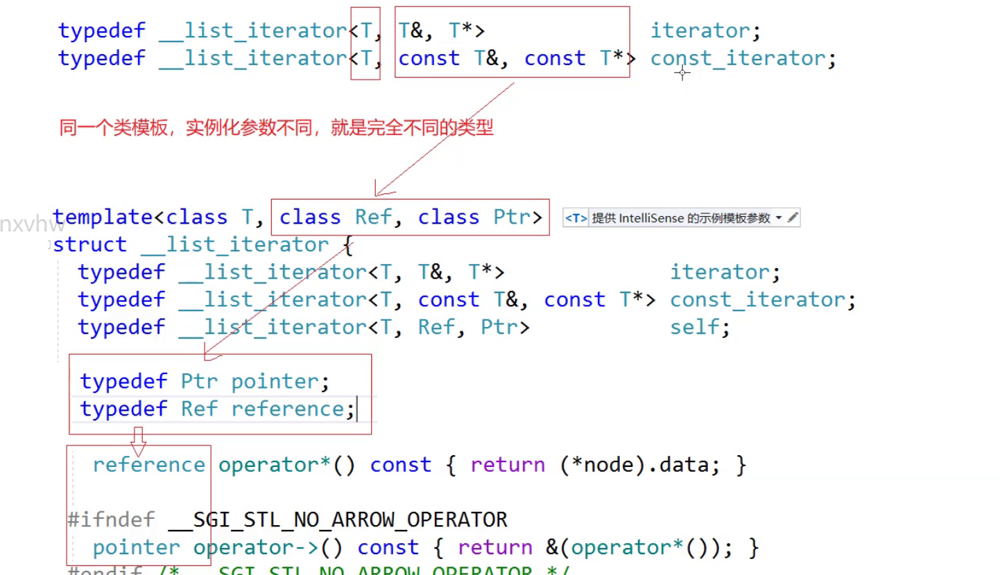

# list

## usage
带头双向循环链表


模板参数+内存配置器
O(1)的时间复杂度能够支持任意地方插入、删除
不支持方括号操作，不过效率会很低，因为其空间不是连续的，所以遍历只能使用迭代器运行，而且并非原生指针


### detail 构造

拷贝构造是一个深拷贝
析构需要一个节点一个节点地释放


assign是一个赋值

### operation
#### reverse->逆序
#### sort
算法库里的sort不能使用，因为算法库有的是用的两个迭代器直接相减，而list的地址不连续，容器的迭代器是在性质上分类的：**单向**、**双向**、**随机**。
性质上：(与容器的底层实现有关系)
单向：支持++,单链表/哈希表
双向：支持++/--，双向链表list，红黑树（map/set）

随机：++/--/+/- vector/string/deque
功能上：
正向、反向、const、非const
**单向能用的算法、双向都能使用，双向能使用的算法，随机都能使用**
默认是升序//模板less
降序是大于//模板greater

**使用**：降序
使用一：
匿名对象使用
链表的底层算法是归并排序
注意：数据量小是可以的使用，但是数据量大了就不太方便了，性能上是没有优势的

所以我们可以先把其拷贝到vector，sort之后，然后再拷贝回来
#### merge
将两个链表归并在一起，取小的尾插，必须要先sort，会自动去重


#### remove

remove一个不存在的值也是啥也不做

#### splice
将一个链表转移到另外一个链表，转移到某一个节点之后，原链表会被置空


## make


```cpp
namespace cy
{
    template<class T>
    struct list_node
    {
        T _data;
        list_node<T>* _next;
        list_node<T>* _prev;
        list_node(const T&x = T())//匿名对象
            :_data(X)
            ,_next(nullptr)
            ,_prev(nullptr)
        {}
    };
    template<class T>
    class list
    {
        typedef list_node<T> Node;
    public:
        void empty_init()
        {
            _head =new Node;
            _head->_next = _head;
            _head->_prev = _head;
        }
        list()
        {
            empty_init();
        }
        void push_back(const T&x)
        {
            Node*tail =_head->_prev;
            Node*newnode = new Node(X);
            tail ->_next = newnode;
            newnode->_prev = tail;
            newnode->_next = _head;
            _head->_prev = newnode; 
        }
        void insert(iterator pos, constT&val)
        {
            Node* cur = pos._node;
            Node* newnode = new Node(X);
            Node* prev = cur ->prev;
            //后序连起来即可->删前一个
        }
        void erase(iterator pos)
        {
            
            //erase会失效，应该返回下一个元素的iterator
        }

        void clear()
        {
            iterator it = begin();
            while(it!=end())
            {
                it = erase(it);
            }

        //list(const list<T>& It)//注意const类型
        list(list<T>& It)//注意const类型
        {
            empty_init();
            for(auto e : It)
            {
                push_back(e);
            }
        }
        ~list()
        {
            clear();
            delete _head;
            _head = nullptr;
        }
        list<T>&operator = (const list<T>& It)
        {
            if(this!= &It)
            {
                clear();
                for(auto e:It)
                {
                    push_back(e);
                }

            }
            //或者直接调用拷贝构造，使用swap
            return *this;
        }
        self operator++(int)//后置++返回的是之前的值
        {
            self tmp(*this);
            _node = _node->nextl;
            return tmp;
        }
    private:
        Node* _head;
        size_t _size;//可有可无，主要是size时的时间复杂度
    };
}


```

### iterator
对迭代器的直接解引用是失效的，因为指针对应的一个结构体，所以这里可以使用运算符重载
运用重载运算符去控制节点的操作
底层是链表的遍历，但是面上看不出来
**封装**
**封装**
**封装**
屏蔽底层差异和实现细节
统一访问修改和遍历方式


但这里实际上是省略了箭头的，编译器做了特殊的处理。可读性不好

### const迭代器
const iterator是错误的，这里修饰的是迭代器本身
所以需要单独实现一个const_iterator，所以可以给一个单独的类


const是本身可以修改，但是指向的内容不能修改

同一个类模板，只要参数不同，就不是一个类型



### class和typename
在类模板没有被实例化之前，编译器是不会去进行对该类里面的进行操作的。编译器无法确定是内嵌类型还是静态成员变量
前面加一个typename就是告诉编译器，这里是一个类型


模板实现泛型编程，将所有的事交给编译器