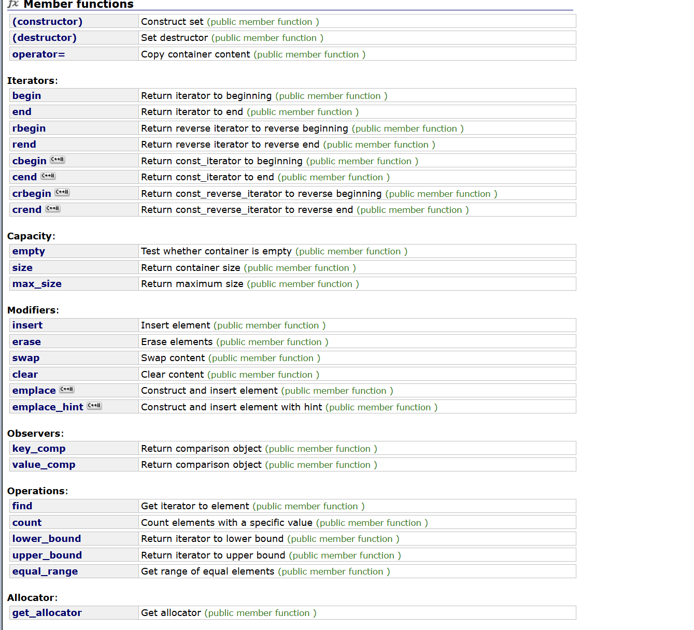

# map & set
## 关联式容器
序列式容器->单纯存储数据，vector、list、queue等
关联式容器->数据之间有关联map/set等
这是一个仿函数

set是一个key搜索模型的容器，只判断在不在

## set使用
set不支持修改，改了就不是搜索树了，
查找在不在
排序+去重
### insert插入
```cpp
void test_set1()
{
	set<int> s;
	s.insert(2);
	s.insert(1);
	s.insert(3);
	s.insert(3);
	s.insert(3);

	s.insert(4);
	set<int>::iterator it= s.begin();
	while (it != s.end())
	{
		cout<<*it<<endl;
		it++;
	}
    
}
```

迭代器走的是中序遍历，并且底层是红黑树，因此存在的元素值在有且仅有一个

接受的时候需要用一个pair进行接受


### 删除
```cpp
	s.erase(3);
	set<int>::iterator it = s.find(3);
	if (it != s.end())
	{
		s.erase(it);
	}
	for (auto e : s)
	{
		cout << e << " ";
	}
```


### lower_bound&upper_bound


### equal_range()

### pair
pair是一个类，是一个键值对

一般包含一个key和value，key一一对应value

## multiset

排序
允许相同的值插入，相当于一棵变异的搜索树
find返回的迭代器地址值是中序的第一个val
### equal_range\count对于multiset的意义
可以一次性删掉很多重复的val
因为第一个>=2,第二个>2
count可以计数
### erase
可以一次性删除所有的val，并且返回一个size_t的类型，值为个数

## map
k,v型的数据结构
### insert

```cpp
	map<string, string> dict;
	dict.insert(pair<string,string> ("sort","排序"));
	dict.insert(pair<string, string>("insert", "插入"));
	dict.insert(pair<string, string>("right", "右边"));
	dict.insert(make_pair("right", "右边"));//自动推演，本质是返回一个pair<T1,T2>
	map<string, string>::iterator it = dict.begin();
	while (it != dict.end())
	{
		cout << (*it).first << ":";
		cout << (*it).second << endl;
		cout << it->first << ":";
		cout << it->second << endl;
		++it;
	}
	for (auto& kv : dict)
	{
		kv.second += 'jj';
		cout << kv.first << ":";
		cout << kv.second << endl;
	}
```
value_type 是一个pair
尽管我们大多数时候传的匿名对象对不上const，但是pair具有拷贝构造，可以根据传参进行构造形参

### make_pair
函数模板,自动推演模板参数


### 计数场景
```cpp
string arr[] = { "苹果","香蕉","苹果","香蕉", "苹果","香蕉", "苹果","香蕉", "苹果","香蕉" };
	map<string, int> mapcount;
	for (auto& str : arr)
	{
		//auto ret = mapcount.find(str);
		//if (ret == mapcount.end())
		//{
		//	mapcount.insert(make_pair(str, 1));
		//}
		//else
		//{
		//	ret->second++;
		//}
		mapcount[str]++;
	}
    dict["erase"] = "删除"；
	for (auto& kv : mapcount)
	{
		cout << kv.first << ":" << kv.second << endl;
	}
```

### []如何实现

insert返回一个pair，第一个元素要么指向新的节点，要么返回和他相同的节点，第二个元素是一个bool，成功插入为true，如果存在相等，即返回false。
这里内部的pair是insert的pair，这个pair包含了元素的迭代器以及是否插入成功的信息，第二个pair是map的迭代器，则他的second就是对应的key.
**dict["erase"] = "删除"；**
可以直接通过value进行修改
功能有：
```cpp
dict["hhh"];//插入
cout<<dict["hhh"];//查找
dict["hhh"]="sda";//修改
```
## multimap
允许键值冗余，所以他就不支持方括号[]，因为按照原来的逻辑，会引起歧义。

## oj 题目
### 前K个高频词
https://leetcode.cn/problems/top-k-frequent-words/description/
首先一个循环进行计数，map按first进行排序，没有按照count进行排序，并且不能使用sort进行排序，因为sort只支持随机迭代器，所以可以考虑放在vector中在进行sort，但是pair比较大小是first和second中任意一个小就是小，所以需要仿函数。
小于就是升序，大于就是降序，但是仍然会有问题，快排不是稳定排序，会改变相对位置，所以使用stable_sort()稳定排序或者自己控制


### 两个数组的交集I
https://leetcode.cn/problems/intersection-of-two-arrays/description/
首先需要两个set，这样的话就全部元素都只有一个，set的特点是排序+去重
找交集：
1.相同就是交集，it1和it2同时++
2.不相同，小的++
有一个结束了就结束了
找差集：
1.相等，同时++
2.小的是差集值，每次指针小的++