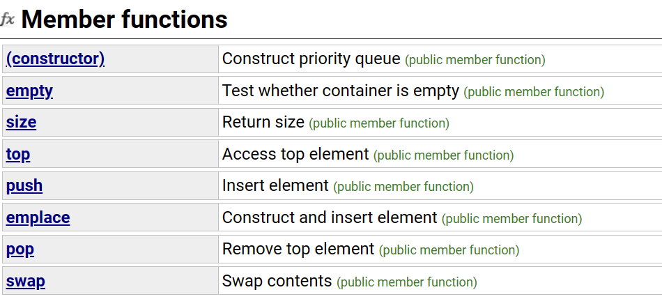

# priority_queue
**容器适配器**

**接口**

放在queue函数库里的

## usage

默认是一个大堆，所以堆顶的数据是最大的
插入和删除的效率$logN$
priority_queue<int> v ->大堆
priority_queue<int，vector<int>,greater<int> q> v ->小堆

## 模拟实现
```cpp
template<class T ,class Container=vector<T>>
    class priority_queue
    {
        public:
            void adjust_up(int child)
            {
                int parent = (child-1)/2;
                while(child>0)
                {
                    if(_con[parent]<_con[child])
                    {
                        swap(_con[parent],_con[child]);
                        child = parent;
                        int parent = (child-1)/2;
                    }
                    else
                    {
                        break;
                    }
                }
            }
            void adjust_down(int parent)
            {
                int child = parent*2+1;
                while(child<_con.size())
                {
                    if(chlid+1<_con.size()&&_con[child+1]>=_con[child])
                    {
                        child = child+1;
                    }
                    if(_con[child]>_con[parent])
                    {
                        swap(_con[child],_con[parent]);
                        parent =child;
                        child =parent*2+1;
                    }
                    else
                    {
                        break;
                    }
                }


            } 
            void pop()
            {
                swap(_con[0],_con[_con.size()-1]);
                _con.pop_back();
                adjust_down(0);
            }

            void push(const T&x)
            {
                _con.push(const T&x);
                adjust_up(_con.size()-1);

            }
    }

```

### 仿函数
一个类如果重载()，就像函数一样使用，但是是一个运算符重载

功能上：实现的是一个类型，替代函数指针
特点：是一个类
```cpp
template<class T,class Container= vector<T>,class Compare = less<T>>
//大堆是Less，小堆是Greater
```

注意一下的区别：
**优先级队列传递的是一个类模板参数，必须实例化，是一个类型
而sort传递是一个函数模板参数，无需实例化，编译器会自动推演，是一个匿名对象**

函数模板和类模板：

也可以给我留空间。可以在有自定义类型操作的时候更方便


### 迭代器构建


