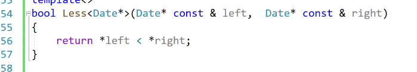
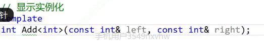
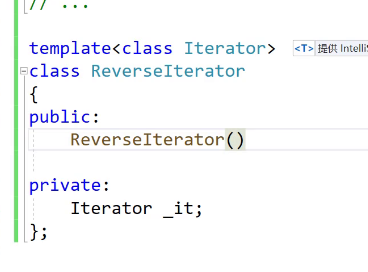
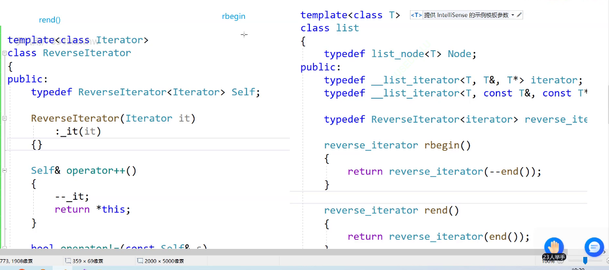
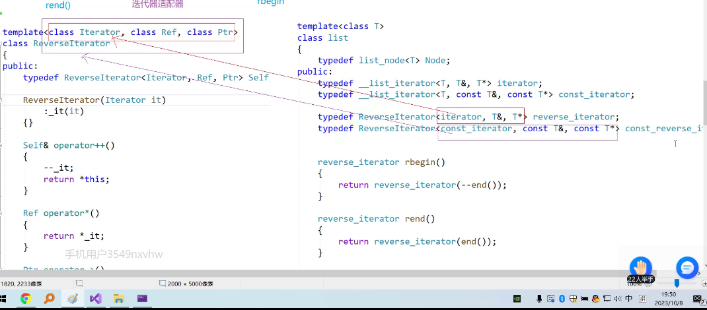
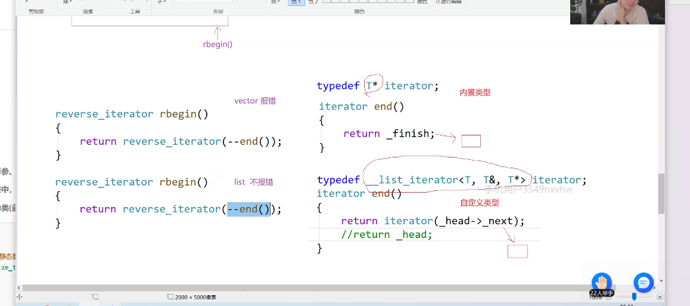
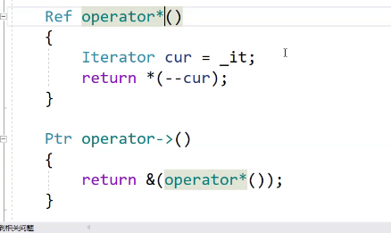

# 模板
## 非类型模板参数
template<class T,size_t N>
后面传送一个常量即可灵活控制，并且仅能是常量，不能传送变量，只支撑整形---int\char\size_t
array是一个静态数组
array<int,10> a1
array的下标越界检查是存在的，因为是一个函数调用，可以进行检查，但是价值也不大，vector能够完全实现其功能

### 类模板特化
针对某些类型进行特殊化处理

```cpp
template<class T1,class T2 >
class A{};
//全特化
template<>
class A<int ,double>//该类是上类的特殊化，如果是int，double编译器就会匹配该类进行实例化
{};
//偏特化
template<class T1>
class<T1,double>//一半的特化
//偏特化
template<class T1*，class T2*>;
class A<T1*,T2*>//这里是针对指针的偏特化，只要是指针就拿进来
```
有的类型，比如指针和非指针，处理方法是不一样的，可以进行特化，正常的走一般类，特殊的走特化
特化不能够单独存在，同样，编译器也只会匹配最匹配的类
偏特化的本质是对参数的限制

## 函数模板特化
```cpp
template<>
bool less<Data*>(Data*left,Data*right)
{
    return left < right;
}
```



#### 类模板用特化，函数模板不需要用特化
函数模板用重载即可


## 模板分离编译
函数模板不能够进行分离编译
编译器处理过程：
1.预处理
头文件展开/宏替换
2.编译
检查语法生成汇编代码
3.汇编
4.链接

关键问题就是模板没有进行实例化
解决方法：

但是缺点是模板的意义不存在了，或者说每次一个类型都要单独显式实例化，类模板也可也显示实例化，声明和定义全部放在.h就没有问题或者说hpp也可以，说明就是h+cpp内容都有

## 模板缺陷
1.代码膨胀问题
2.定位出错问题


# 迭代器
反向迭代器用正向迭代器进行适配，将iterator当作一个模板，这样的话任何一个容器可以对应适配成其的iterator



适配器的前提是有功能的重叠


临时对象具有常性，不能--：

匿名对象也具有常性，但是自定义类型又可以去调用非const对象


