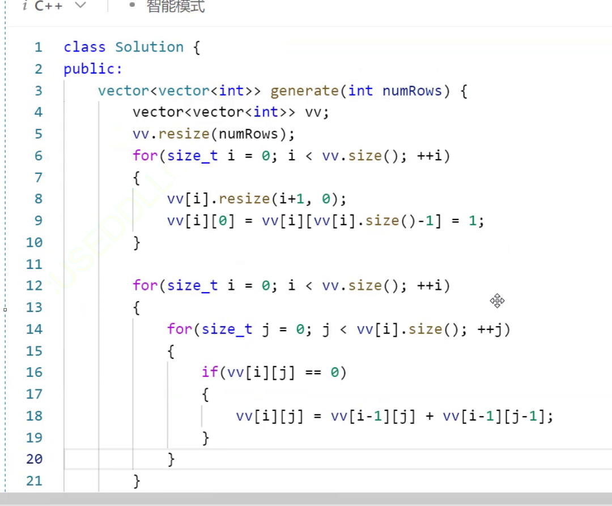

# std::vector
template < class T, class Alloc = allocator<T> > class vector; // generic template
vector是一个由动态数组构成的容器
vector没有流插入和流提取，用范围for迭代器都可以
## 初始化
```cpp
	vector<int> v1;//无参初始化
	vector<int> v2(10, 0);//有参
	vector<int> v3(v2.begin(), v2.end());//迭代器
	string str("saas");
	vector<int> v4(str.begin(), str.end());//模板特性
	vector<int> v5(v4);//拷贝构造
    	vector<int>::iterator it = v3.begin();
	while (it != v3.end())//end指向最后一个元素的下一个位置
	{
		cout << *it << " ";
		it++;
	}
	cout << endl;
```

## capacity
扩容机制
```cpp
vector<int> v1;
v.push_back(1);
v.push_back(1);
v.push_back(1);

v.push_back(1);

v.push_back(1);


```
在windows下的vs中扩容大概是1.5
而在linux下的gcc是2倍

### max_size()不具任何参考意义的函数


### reserve
避免扩容，提前开好空间，其不会改变size，所以在未定义size之前不能对开好的空间进行操作，因为[]会有断言


### resize
会重新定义大小，并且会将后面的插入在重定义大小的后面，可能还会扩容
resize会使capacity和size 都改变，比当前空间大，就会扩容，默认参数是0

### shrink_to_fit
缩容接口，以时间换空间的函数，异地扩容
将capacity变成size的大小
也可以释放空间

## modify
进行增删查改
### push_back
实例化什么就是什么类型
尾插

### pop_back
尾删


### insert
```cpp
vector<int> v1;
vi.insert(pos,val);
vi.insert(pos,numbers,val);
//都是在pos之前，或者一段迭代器也可以v.begin()即可

```


### erase

iterator erase (iterator position);iterator erase (iterator first, iterator last);

### swap


### clear
一般不会清理capacity


### 算法库里有一个find
<algorithm>
所有容器中都可以用
string中需求不一样所以自己写了一个find

int x = find(first,last,val);

## oj
### 只出现一次的数字
给你一个 非空 整数数组 nums ，除了某个元素只出现一次以外，其余每个元素均出现两次。找出那个只出现了一次的元素。
你必须设计并实现线性时间复杂度的算法来解决此问题，且该算法只使用常量额外空间。
```cpp
//异或方法
class Solution {
public:
    int singleNumber(vector<int>& nums) {
		int val = 0;
		for(auto e:nums)
		{
			val^=e;
		}
		return val;
    }
};
```

### 杨辉三角
给定一个非负整数 numRows，生成「杨辉三角」的前 numRows 行。
c语言需要先开一个二级指针，指针数组，然后再循环开辟每个指针数组的值
```cpp
class Solution {
public:
    vector<vector<int>> generate(int numRows) {
	//里面的数据是一个一个的vector，一个一个vector是int*


    }
};
```

vv[][]:前一个是访问第几个vector<int>对象



## vector模拟实现
看源码不能一行一行看、先拉框架，不研究细节、多思考、再实践
类：成员变量+成员函数


### resize
```cpp
void resize(size_t n, const T& val = T())// T()是匿名对象，隐式类型转换，而常引用可以让匿名对象生命周期延长
{}
//会涉及到迭代器失效，这里写代码的时候有可能会有由于野指针造成的迭代器失效
```
### 
会涉及到迭代器失效，这里写代码的时候有可能会有由于野指针造成的迭代器失效
传值的时候用的原来的迭代器指向位置，这样的话传值进去，此时迭代器会在执行完insert后失效，并且传引用不好，因为这样的方式会让直接传值（begin（）地址）的方式失效，因为引用不能对常性变量产生效果


### erase

那么这里的迭代器会不会失效呢？

第一组正常的原因是因为是巧合：只要有连续的偶数都会进行报错，因为erase后原变量指向的空间与现在迭代器指向空间是不同的，已经被delete掉了
不过，erase会返回删除数据的下一个位置，解决迭代器失效的问题
所以要进行接受返回值，这样才是下一个位置


### vector存string

问题：memcpy只是将_start的那段首地址及其后面的空间内容拷下去，但是delete直接将原有的地址上的元素进行删除，每一个string对象会调用析构函数
所以变为赋值，也就是深拷贝:


### vector的拷贝构造


## oj
电话号码的字母组合
首先几个数字对应一个字符串有多长，多叉树的遍历，递归的写法是最简单的走法
