# 多态
## 多态概念
多种形态，同一个动作，不同的对象产生的效果不同
增加了虚函数
```cpp
class Person {
public:
 virtual void BuyTicket() { cout << "买票-全价" << endl; }
};
class Student : public Person {
public:
 virtual void BuyTicket() { cout << "买票-半价" << endl; }
/*注意：在重写基类虚函数时，派生类的虚函数在不加virtual关键字时，虽然也可以构成重写(因
为继承后基类的虚函数被继承下来了在派生类依旧保持虚函数属性),但是该种写法不是很规范，不建议
这样使用*/
/*void BuyTicket() { cout << "买票-半价" << endl; }*/
};
void Func(Person& p)
{ p.BuyTicket(); }//调用
int main()
{
StudePerson ps;
nt st;
Func(ps);
Func(st);
 return 0;
}
```
## 多态构成条件
1、虚函数重写
2、父类的指针或者引用去调用虚函数

## 虚函数重写
父子继承关系的两个虚函数，三同（函数名、参数、返回），并且virtual只能修饰成员函数
不过：**例外**
**1.协变->返回值不同**
即基类返回基类对象的指针或引用
派生类返回派生类对象的指针或引用
其他类皆可
**2.基类中写了virtual，派生类重写的虚函数可以不加virtual**
可以理解成继承，构成了重写
**3.析构函数重写**
析构函数是虚函数看，才能正确调用析构函数，基类中写了虚函数，派生类也可以不写了
只有派生类Student的析构函数重写了Person的析构函数，下面的delete对象调用析构函
数，才能构成多态，才能保证p1和p2指向的对象正确的调用析构函数。（主要是为了保证子类赋值给父类的情况能够调用子类的析构函数）
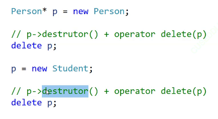
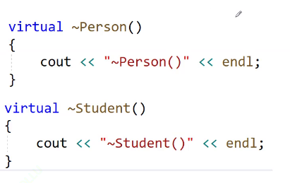当然派生类可以不写

#### 经典例题
这里为什么val=1,因为多态是调用父类的接口，使用的是子类的重写
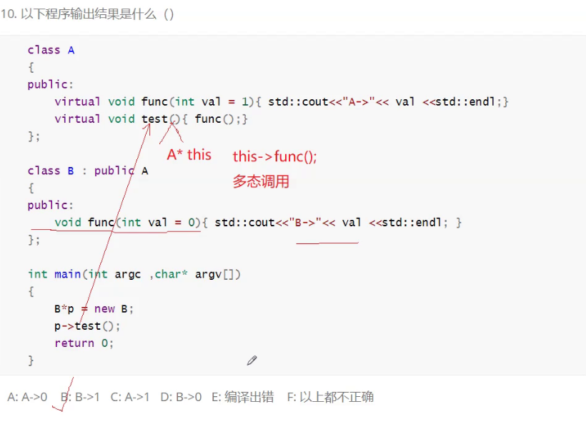


## 重载、重写（覆盖）、重定义（隐藏）的对比
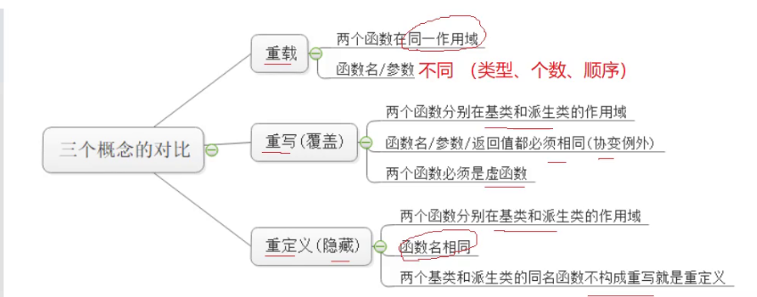
重写的要求比重定义要求更严格
**final修饰类，不能被继承；修饰虚函数，不能被重写**
**override修饰派生类的虚函数，检查是否完成重写**


## 抽象类
### 概念
虚函数后加=0，则这个函数为纯虚函数。包含纯虚函数的类叫做抽象类（接口类），不能实例化出对象，指针是可以的
```cpp
class Car
{
public:
virtual void Drive() = 0;
};
class Benz :public Car
{
public:
 virtual void Drive()
 {
 cout << "Benz-舒适" << endl;
 }
};
class BMW :public Car
{
public:
 virtual void Drive()
 {
 cout << "BMW-操控" << endl;
 }
};
void Test()
{
Car* pBenz = new Benz;
 pBenz->Drive();
 Car* pBMW = new BMW;
 pBMW->Drive();
}
```
在继承的派生类中对该虚函数进行重写，这样能够实现传谁调谁。
**抽象类的意义**：
强制子类对该函数进行重写
将现实中不存在的一些抽象概念进行归纳，比如动物、职业，区别于马、狗、医生、教师。因此也不能实例化出对象
也暗示有多个子类
普通函数继承是一个实现继承->继承实现内容
虚函数继承是一个接口继承->继承接口，重写内容
## 多态的原理
C++会将虚函数存在一张虚函数表中
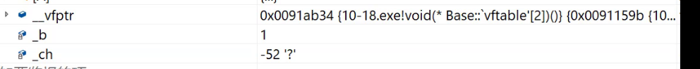
多了一个指针，虚函数表指针(virtual function ptr)

虚函数表上存了虚函数的地址，是一个指针数组。不过虚函数的本体还是在代码段上。
### 底层
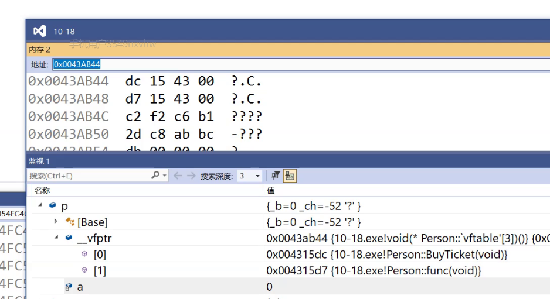
虚函数重写也叫做虚函数覆盖
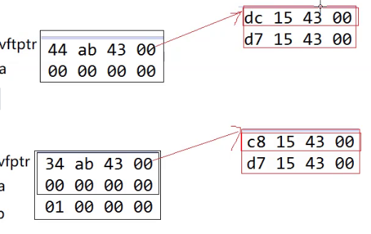
如果发生重写，则对应类的虚函数表的对应虚函数地址会被覆盖

为什么可以指向父类调父类，指向子类调子类，因为在运行起来之后，会根据指针指向去找虚表中对应的函数地址。
普通调用和多态调用在汇编上的区别：
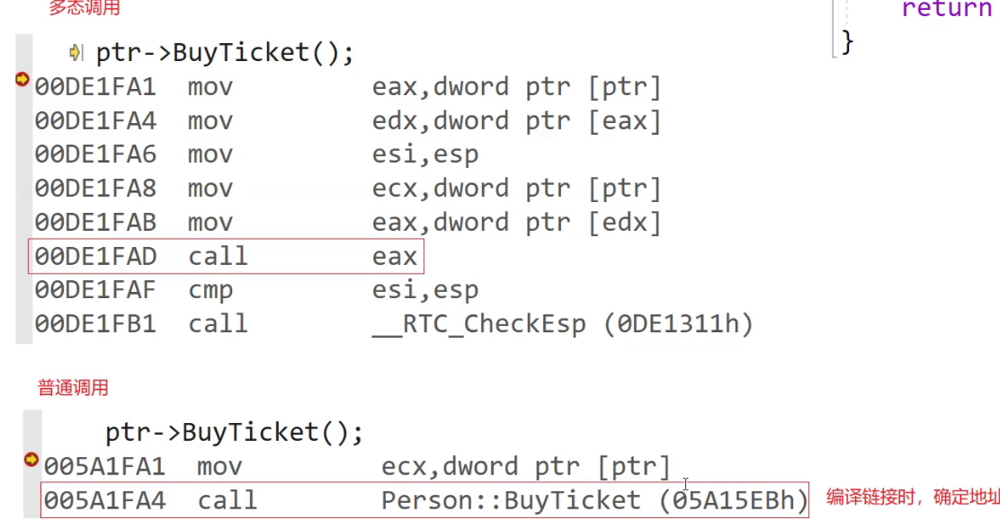
eax寄存器中存储的是虚表
编译链接时，确定地址


**为什么多态不能通过对象操作?**
当我们传指针或者引用时把指向父类的那一块变成别名切割出来的一部分。
但是对象需要把值拷贝构造给出，但是不会拷贝虚表指针，只会拷贝父类成员给子类。
如果将虚表指针拷贝过来，多态调用，指向父类，调用的不一定是父类虚函数，因为子类对虚表内容的更改也会将父类进行更改，比如析构函数调用，也会出错。
chat:
在C++中，多态通常是通过指针或引用来实现的，而不能通过直接传递对象。这是因为多态性依赖于动态绑定，也就是在运行时才决定调用哪个函数，而这一机制是通过虚函数表（vtable）实现的。下面是为什么多态不能通过传递对象来操作的一些详细解释：

1. **对象切割（Object Slicing）**：当通过值传递对象时，如果传递的是一个派生类对象而形参类型是基类，那么传递过程中会发生对象切割。对象切割指的是派生类对象赋值给基类对象时，超出基类范围的部分（即派生类特有的数据成员和行为）会被切掉，仅剩下基类部分。这样一来，派生类的特有功能和数据就丢失了，无法实现多态。

2. **虚函数表和动态绑定**：在C++中，类中的虚函数通过一个虚函数表来实现动态绑定。每一个对象都包含一个指向虚函数表的指针（通常是隐藏的）。通过这个表，运行时可以确定应该调用哪个虚函数。当通过对象传递时，由于对象切割，相关的虚函数表可能不再指向正确的实现，因此无法正确执行派生类的方法。

3. **指针和引用**：为了使多态正常工作，我们通常使用指针或引用来传递对象。这样做可以避免对象切割，保持虚函数表指针的正确性，从而在运行时能够根据实际对象类型调用相应的虚函数。这是实现多态的关键。

总结来说，通过传递对象（即通过值传递）无法实现多态，主要是因为这种方式会导致对象切割，丢失派生类的数据和行为，以及破坏虚函数的动态绑定机制。因此，要实现多态，建议使用指针或引用来传递对象。这样可以保留对象的完整性和类型信息，使动态绑定在运行时正确进行。


按照现在的逻辑来说，如果子类没有对虚函数进行重写，那么子类和父类各有一张虚表，但是表上的内容是一样的，不会使用同一张表，单继承，一个类共用一张虚表a


**虚函数存在哪的？虚函数表存在哪的？**
虚函数存在代码段中的，和普通函数放在一块的，虚表存的是虚函数地址，虚函数表放在代码段中
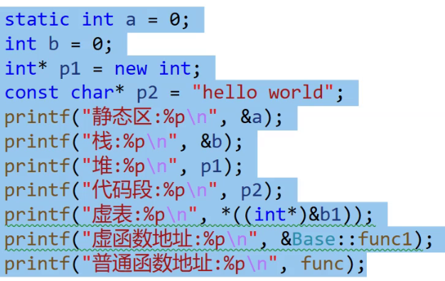
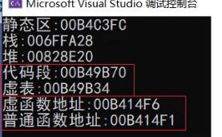


**虚函数地址一定会被放进类的虚表中吗？**
是的

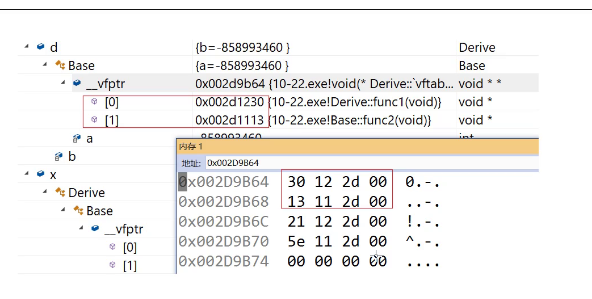
//打印函数指针
```cpp
typedef void (*VFUNC)();

void PrintVFT(VFUNC a[])
{

    printf("");
}

int main()
{
    void (*f1)();//定义函数指针
    VFUNC f2;
}

```

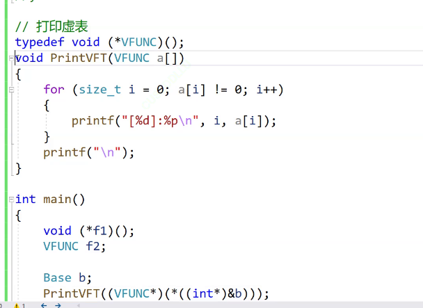
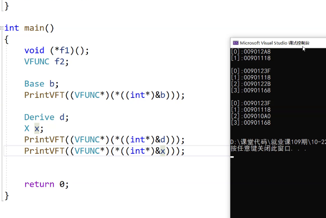
调用函数的两种方式
f();
(*f)();//函数指针
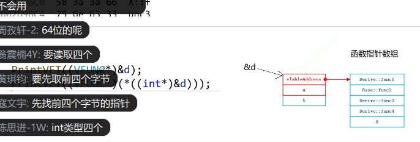
先转int*是因为要前四个字节，才能取到一个完整的地址
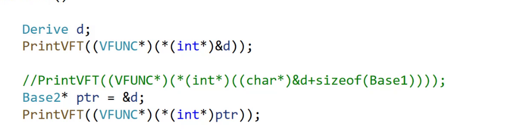
直接完成切片
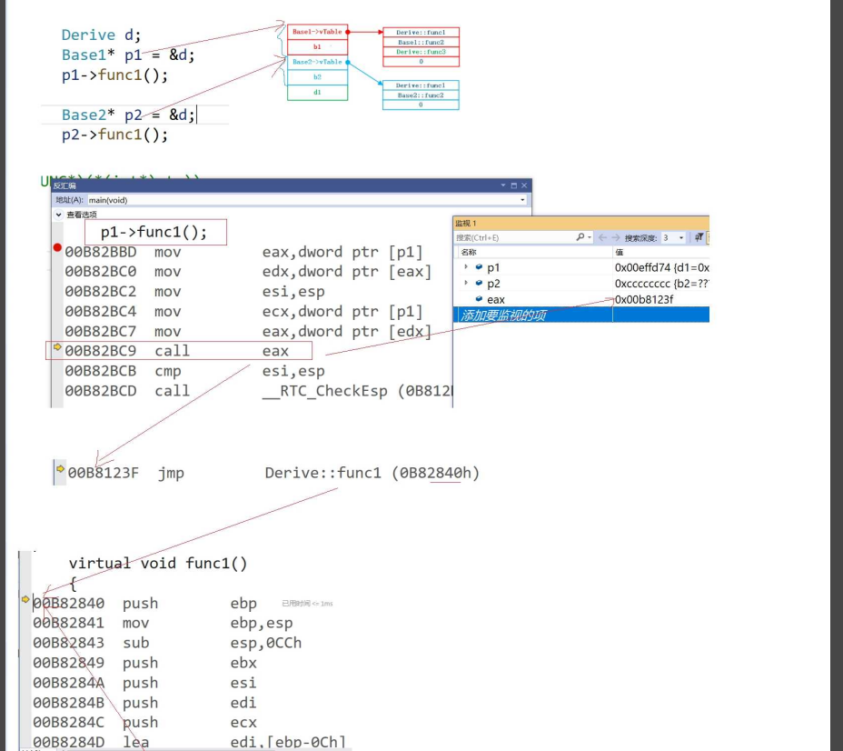
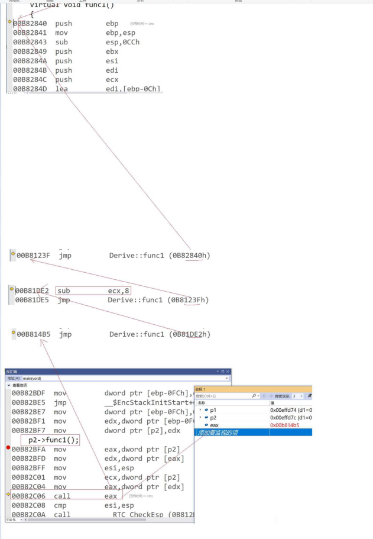
这里在调用func1()时多走了几步是因为去转换。指向derive对象


## 问题
### 什么是多态
静态多态：函数重载
动态多态：父类的指针或者引用调用虚函数/虚函数完成重写

### inline函数可以是虚函数吗
普通调用就可以是内联，但是多态调用，inline不起作用


### 静态成员可以是虚函数吗
不可以，因为static成员函数没有this指针，无法构成多态

### 构造函数可以是虚函数吗
不可以，因为对象中虚表指针是构造函数阶段才初始化的


### 析构函数可以是虚函数吗
最好是虚函数
父类指针 = new 子类对象
delete 父类指针