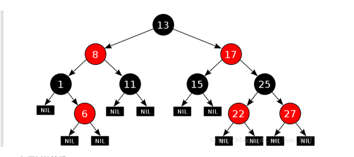
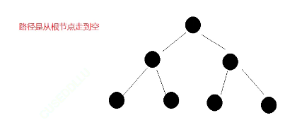
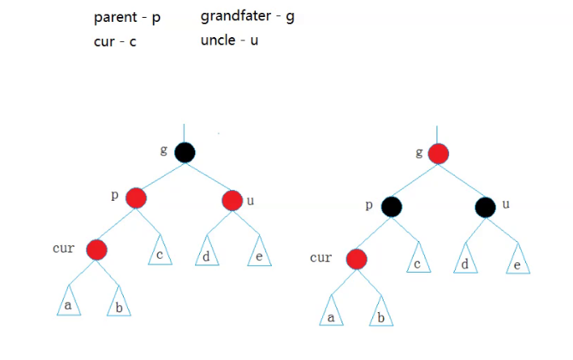
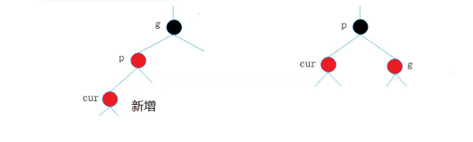
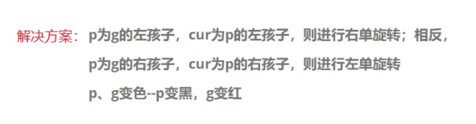
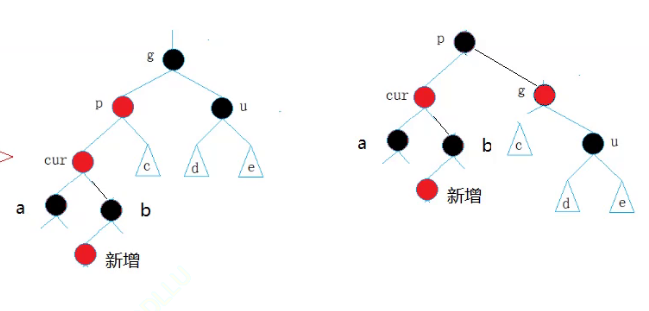
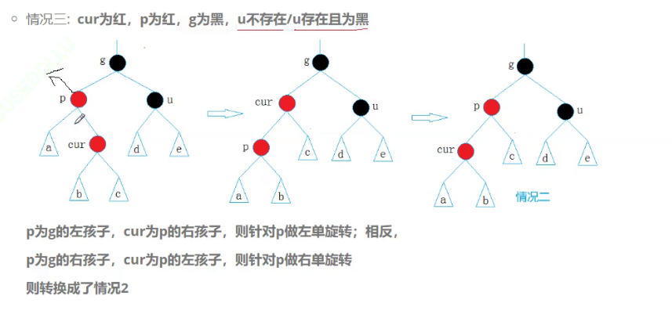

# 红黑树
红黑树对每个结点增加颜色位进行控制，确保最长路径不会比最短路径长出两倍。
搜索效率确实比avl低，但是CUP效率足够高，实际上只是常数级别差距，影响不大

## 红黑树性质

1.红黑树非黑即红
2.根节点是黑色的
3.颜色为红的节点，则它的孩子节点是黑色->树中不能出现连续的红色节点：黑+黑/红+黑/黑+红->最短节点全黑，最长节点红黑交替
4.每条路径都包含相同的黑色节点
5.每个空节点（NIL节点）都是黑色

所以该树有八条路径

## 定义
```cpp
enum Color
{
    RED,
    BLACK
};
template<class K,class V>
struct RBTreeNode
{
    RBTreeNode<K,V>* _left;
    RBTreeNode<K,V>* _right;
    RBTreeNode<K,V>* _parent;
    pair<K,V> _kv;
    Color _CO;
    RBTreeNode(const pair<K,V>& kv)
        :_left(nullptr)
        ,_right(nullptr)
        ,_parent(nullptr)
        ,_kv(kv)
        ,_CO(RED)
    {}
}
```

## 插入
每次新增插入黑色节点会影响所有节点，新增插入红色节点只会影响父亲，**所以新增节点选择新增红色节点**
**1.新增节点父亲是黑色，那么就插入结束，不需要处理**
**2.新增节点父亲是红色，需要处理（变色/变色+旋转）**



**所以需要更改时祖父一定是黑**，**父亲一定是红**

### 红黑树调整关键看叔叔
**情况一：叔叔是红色，p为红，g为黑**
将父亲和叔叔变黑，将祖父变红（子树凭空多了黑节点，所以是为了保证黑节点数相同），然后将祖父当成cur，继续向上调整，上面是黑的就结束了，但是是红的就需要继续调整


**情况二：叔叔是黑色/不存在**
旋转+变色
**叔叔不存在：**



**叔叔存在且为黑：**
d、e为一个节点的红黑树：



最好像这上面这样变色，这样是个终结态，不需要再往上处理
```cpp
    bool Insert(const pair<K, V>& kv)
    {
        if (_root == nullptr)
        {
            _root = new Node(kv);
            _root->_CO = BLACK;
            return true;
        }
        Node* parent = nullptr;
        Node* cur = _root;
        while (cur)
        {
            if (cur->_kv.first < kv.first)
            {
                parent = cur;
                cur = cur->_right;
            }
            else if (cur->_kv.first > kv.first)
            {
                parent = cur;
                cur = cur->_left;
            }
            else
            {
                return false;
            }
        }
        cur = new Node(kv);
        cur->_CO = RED;
        if (parent->_kv.first < kv.first)
        {
            parent->_right = cur;
            cur->_parent  = parent;
        }
        else
        {
            parent->_left = cur;
            cur->_parent = parent
        }
        while(parent&&parent ->_CO ==RED)//插入后需要调整的条件
        {
            //需要更改时祖父一定是黑**，**父亲一定是红
            Node*grandfather = parent ->_parent;
            if(parent == grandfather->_left)
            {
                Node* uncle =grandfather->_right;
                if(uncle && uncle -> _CO ==RED)//第一种情况
                {
                    //变色
                    parent ->_CO = uncle->_CO = BLACK;
                    grandfather ->_CO =RED
//将父亲和叔叔变黑，将祖父变红（子树凭空多了黑节点，所以是为了保证黑节点数相同），然后将祖父当成cur，继续向上调整，上面是黑的就结束了，但是是红的就需要继续调整
                    cur =grandfather;
                    parent = cur->_parent;
                }
                else
                {
                    if( parent ->_left == cur)
                    {
                        RotateR(grandparent);
                        parent ->_CO =BLACK;
                        grandparent ->_CO =RED;
                    }
                    else
                    {
                        RotateL(parent);
                        RotateR(grandparent);
                        cur->_CO = BLACK;
                        grandparent ->_CO =RED;

                    }
                    break;
                }
            }
            else
            {
                Node* uncle =grandfather->_left;
                if(uncle && uncle -> _CO ==RED)//第一种情况
                {
                    //变色
                    parent ->_CO = uncle->_CO = BLACK;
                    grandfather ->_CO =RED
//将父亲和叔叔变黑，将祖父变红（子树凭空多了黑节点，所以是为了保证黑节点数相同），然后将祖父当成cur，继续向上调整，上面是黑的就结束了，但是是红的就需要继续调整
                    cur =grandfather;
                    parent = cur->_parent;
                }
                else
                {
                    if( parent ->_right == cur)
                    {
                        RotateL(grandparent);
                        parent ->_CO =BLACK;
                        grandparent ->_CO =RED;
                    }
                    else
                    {
                        RotateR(parent);
                        RotateL(grandparent);
                        cur->_CO = BLACK;
                        grandparent ->_CO =RED;

                    }
                    break;
                }

            }
        }
        _root ->_CO = black;//不管cur上面是空结束还是parent是黑都结束的情况都可以用这种方式进行结束，无需特别判断

        return true;
    }
```

### 旋转
```cpp
	void RotateL(Node* parent)
	{
		Node* SubR = parent->_right;
		Node* SubRL = SubR->_left;
		parent->_right = SubRL;
		SubR->_left = parent;
		Node* pparent = parent->_parent;
		parent->_parent = SubR;
		if (SubRL)
		{
			SubRL->_parent = parent;
		}
		if (_root == parent)
		{
			_root = SubR;
			SubR->_parent = nullptr;
		}
		else
		{
			if(pparent->_right == parent)
			{
				pparent->_right = SubR;
			}
			else
			{
				pparent->_left = SubR;
			}
			SubR->_parent = pparent;
		}
		parent->_bf = SubR->_bf = 0;
	}

	void RotateR(Node* parent)
	{
		Node* SubL = parent->_left;
		Node* SubLR = SubL->_right;
		parent->_left = SubLR;
		Node* pparent = parent->_parent;
		parent->_parent = SubL;
		SubL->_right = parent;
		if (SubLR)
			SubLR->_parent = parent;
		if (_root == parent)
		{
			_root = SubL;
			SubL->_parent = nullptr;
		}
		else
		{
			if (pparent->_right == parent)
			{
				pparent->_right = SubL;
			}
			else
			{
				pparent->_left = SubL;
			}
			SubL->_parent = pparent;
		}
		parent->_bf = SubL->_bf = 0;
	}

	void RotateRL(Node* parent)
	{
		Node* SubR = parent->_right;
		Node* SubRL = SubR->_left;
		int bf = SubRL->_bf;
		RotateR(parent->_right);
		RotateL(parent);
		if (bf == 0)
		{
			SubR->_bf = SubRL->_bf = parent->_bf = 0;
		}
		else if(bf == 1)
		{
			parent->_bf = -1;
			SubRL->_bf = 0;
			SubR->_bf = 0;
		}
		else if (bf == -1)
		{
			parent->_bf = 0;
			SubRL->_bf = 0;
			SubR->_bf = 1;
		}
		else
		{
			assert(false);
		}
	}

	void RotateLR(Node* parent)
	{
		Node* SubL = parent->_left;
		Node* SubLR = SubL->_right;
		int bf = SubLR->_bf;
		RotateL(parent->_left);
		RotateR(parent);
		if (bf == 0)
		{
			SubL->_bf = SubLR->_bf = parent->_bf = 0;
		}
		else if (bf == 1)
		{
			parent->_bf = 0;
			SubLR->_bf = 0;
			SubL->_bf = -1;
		}
		else if (bf == -1)
		{
			parent->_bf = 0;
			SubLR->_bf = 1;
			SubL->_bf = 0;
		}
		else
		{
			assert(false);
		}
	}
```

## 测试
### 遍历
void Inordor()
{
    _Inordor(_root);
}
void _Inorder(Node* root)
{
    if(root == nullptr)
    return;
    _Inorder(root->_left);
    cout<</root-/>_kv.first<<endl;
    _Inorder(root->_left);
}


### 平衡
是否符合红黑树标准
```cpp
bool Check(Node* root,int black_number ,const int ref_val)
{
    if(root ==nullptr)
    {
        if(black_number!= ref_val)
        {
        cout<<"出现黑色节点数量不等路径"<<endl;

            return false;
        }
        return true;
    }
    if(root->_CO == RED&&root->_parent->_CO ==RED)
    {
        cout<<"出现连续红色节点"<<endl;
        return false;
    }
    if(root->_CO ==BLACK)
    {
        ++black_number;
    }
    return Check(root->_left,black_number)&&Check(root->_right,black_number);
}


bool ISbalance
{
    if(_root == nullptr)
    return true;
    if(_root ->_CO ==RED)
    return false;
    int ref_val = 0;//引入参考值
    Node*cur = _root;
    while(cur)
    {
        if(cur->_CO == BLACK)
        ref_val++;
        cur = cur ->_left;
    }
    int black_number = 0; //根节点到当前节点路径的黑色节点数
    return Check(_root,black_number,ref_val);//不能传引用
}


```