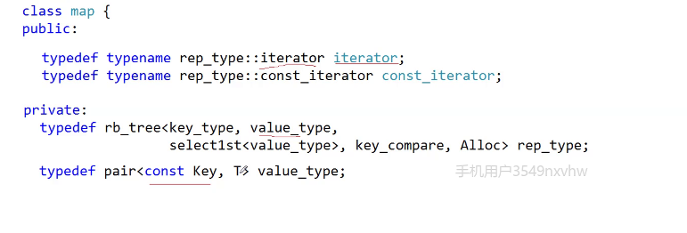
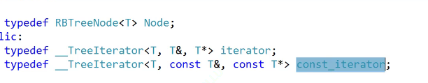
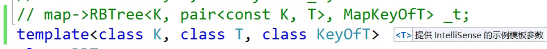

# stl库源码

红黑树的类型由第二个模板参数决定
K/V还是K/pair

## my
参数使用哪个是第二个模板参数决定

如何进行区分和对应的操作呢？
库里面使用一个仿函数，进行配套，K->SET.PAIR->MAP

### 迭代器使用一个节点的指针进行构造

对类模板取内嵌类型，加typename告诉编译器这里是类型

insert返回值要改为iterator+bool的类型
方括号完全利用这个返回值。有就返回，没有就插入

**源码中const迭代器**

增加模板参数：

set因为不能修改，所以直接写一个const，但是，这里注意不是权限降级、iterator 和const——iterator谁两个类型。
而map需要写两个，因为pair.second是需要修改的
pair是带模板参数的构造。模板相同，就是拷贝，模板不同。就是构造
map是pair可以修改，但是first是const

pair构造很关键

第一个模板参数是用来对值的类型进行模板匹配的