# stl库源码
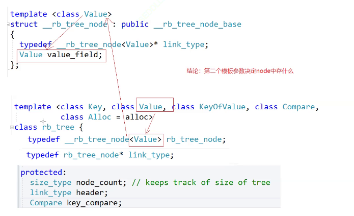
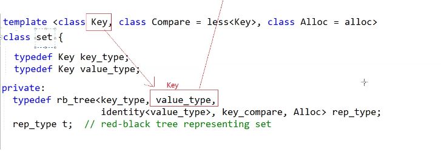
红黑树的类型由第二个模板参数决定
K/V还是K/pair

## my
参数使用哪个是第二个模板参数决定
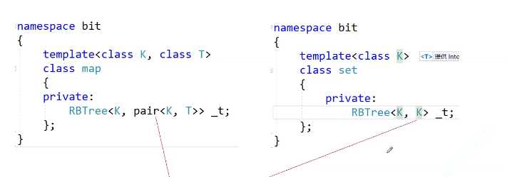
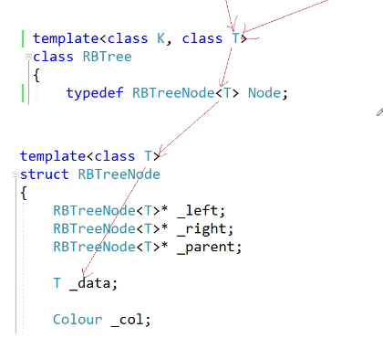
如何进行区分和对应的操作呢？
库里面使用一个仿函数，进行配套，K->SET.PAIR->MAP
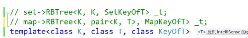
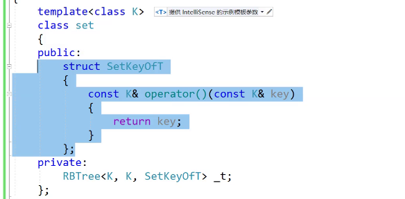
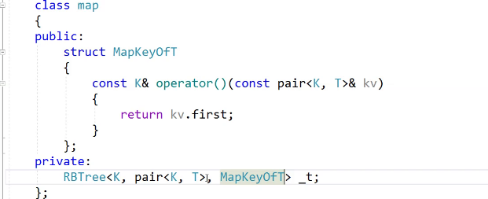
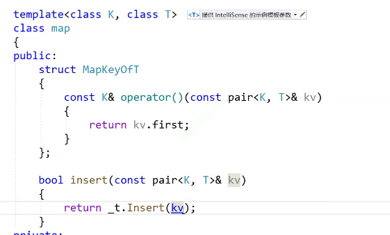
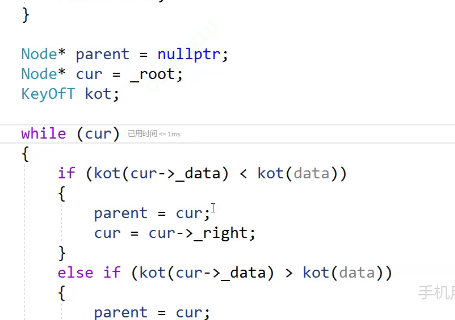
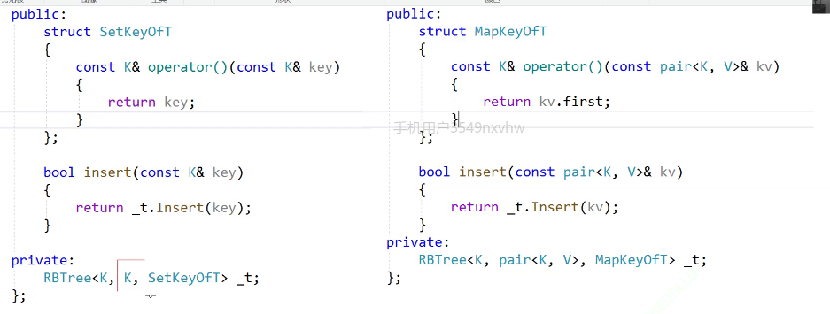

### 迭代器使用一个节点的指针进行构造
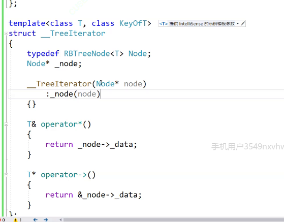
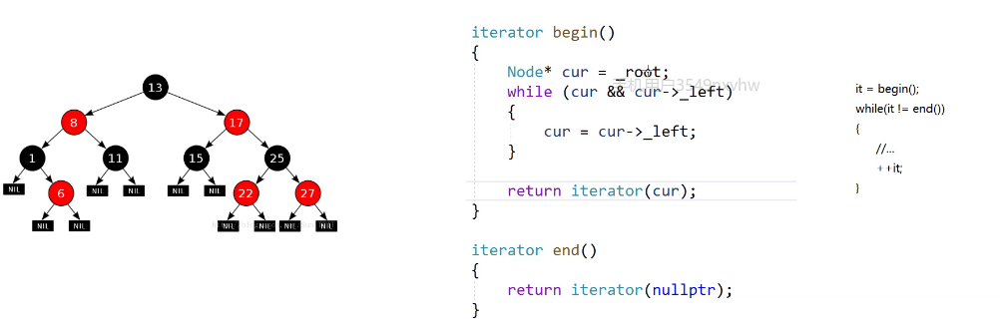
对类模板取内嵌类型，加typename告诉编译器这里是类型
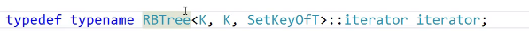
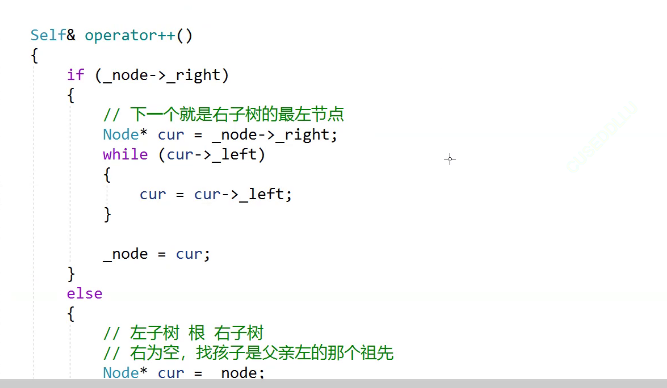
insert返回值要改为iterator+bool的类型
方括号完全利用这个返回值。有就返回，没有就插入
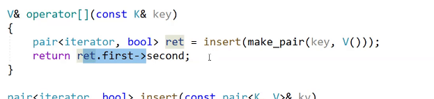