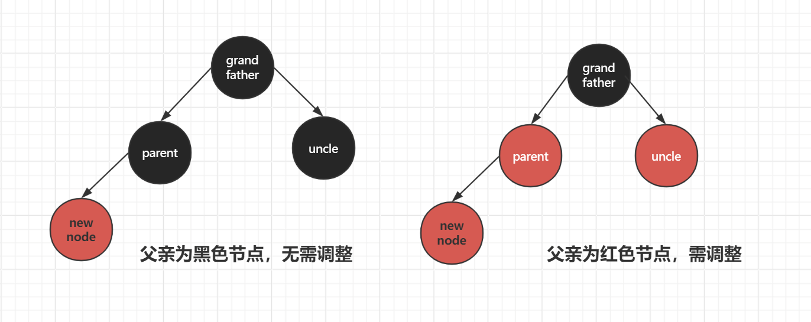
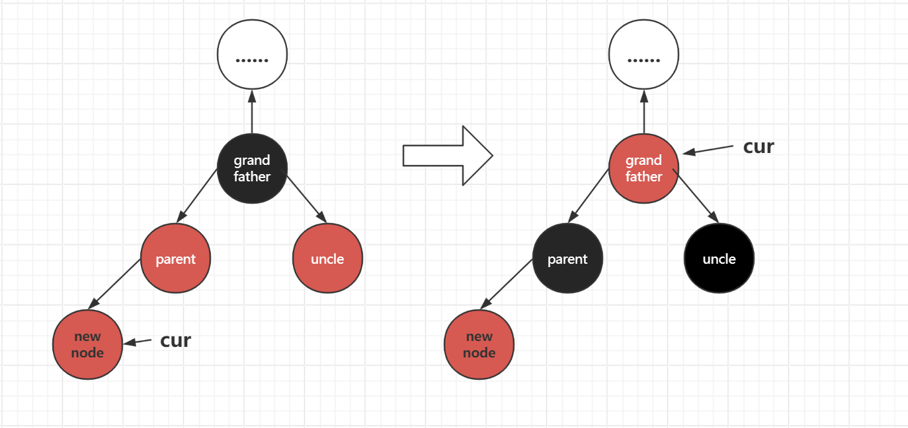
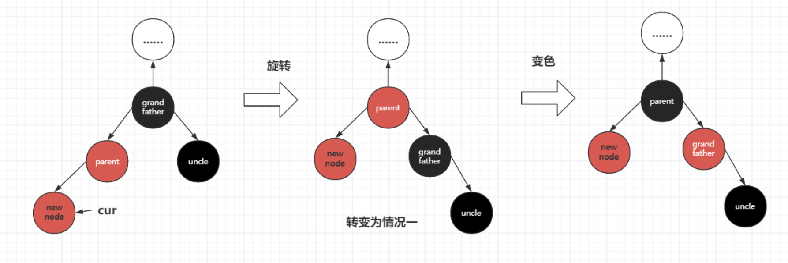

# 红黑树
红黑树顾名思义是一种以颜色作为节点区分的二叉树，具体来说，是一种三叉链的二叉搜索树，相较于平衡二叉树而言，红黑树的控制节点高度的方式从原来AVL树的高度差超过一就频繁旋转调整的方式更改为根据红黑关系进行调整，这样下来，虽然搜索效率不如AVL树，但考虑到二叉树的结构，影响是微乎其微的，但是红黑树的插入效率会有比较大的提升。
## 红黑树的性质
1.红黑树节点非黑即红
2.根节点是黑色的
3.颜色为红的节点，则它的孩子节点是黑色->树中不能出现连续的红色节点：黑+黑/红+黑/黑+红->最短节点全黑，最长节点红黑交替
4.每条路径都包含相同的黑色节点

## 红黑树节点定义
红黑树的节点具有三叉链的结构，除此之外，一般来说考虑键值对的方式进行数据管理，以及对应的节点需要有颜色的标记，对应的代码如下：
```cpp
enum Color
{
    RED,
    BLACK
};
template<class K,class V>
struct RBTreeNode
{
    RBTreeNode<K,V>* _left;
    RBTreeNode<K,V>* _right;
    RBTreeNode<K,V>* _parent;
    pair<K,V> _kv;
    Color _CO;
    RBTreeNode(const pair<K,V>& kv)
        :_left(nullptr)
        ,_right(nullptr)
        ,_parent(nullptr)
        ,_kv(kv)
        ,_CO(RED)
    {}
}
```

## 红黑树插入详解
首先我们需要明确的是红黑树每次新增节点颜色应该选择**红色节点**，考虑前面提到的性质：每条路径上的黑色节点数目相同，那么插入黑色节点会对整条路径产生影响，而插入红色节点只会对自己的父亲产生影响，相比较下来，如果新增节点需要调整，那么调整的范围会小很多。
如果插入节点是红色节点，那么根据性质：路径中不允许出现连续的红色节点，此时父亲的颜色是进行处理的关键根据：
**1.新增节点父亲是黑色，那么就插入结束，不需要处理**
**2.新增节点父亲是红色，需要处理（变色/变色+旋转）**


### 处理方式
**红黑树处理方式关键在于叔叔颜色**
#### 情况一：叔叔是红色
情况一属于比较简单的情况，具体操作就是直接将父亲和叔叔变成黑色，然后再将祖父变成红色，再将祖父编程当前节点，继续向上调整，重复以上过程，如果祖父的父亲是黑色就结束，如果是红色就继续。

对应的代码如下：
```cpp
while (parent && parent->_CO == RED)
        {
            Node* grandfather = parent->_parent;
            if (grandfather->_left == parent)//这里对应两种情况，需要加以区分，以在后序如果需要旋转的情况进行区分
            {
                Node* uncle = grandfather->_right;
                if (uncle && uncle->_CO == RED)
                {
                    grandfather->_CO = RED;
                    parent->_CO = BLACK;
                    uncle->_CO = BLACK;
                    cur = grandfather;
                    parent = cur->_parent;
                }
                //......
            }
            //......
        }

```

#### 情况二：叔叔是黑色/不存在
具体操作就需要旋转+变色，旋转是为了使当前子树的结构变成情况一的结构，再对节点进行变色处理

值得注意的是这里旋转可能需要旋转两次，根据插入节点相对于父亲节点的位置而定。
## 完整红黑树实现及其测试代码
**RBTree.h：**
```cpp
#pragma once
enum Color
{
    RED,
    BLACK
};
template<class K, class V>
struct RBTreeNode
{
    RBTreeNode<K, V>* _left;
    RBTreeNode<K, V>* _right;
    RBTreeNode<K, V>* _parent;
    pair<K, V> _kv;
    Color _CO;
    RBTreeNode(const pair<K, V>& kv)
        :_left(nullptr)
        , _right(nullptr)
        , _parent(nullptr)
        , _kv(kv)
        , _CO(RED)
    {}
};

template<class K, class V>


class RBTree
{
    typedef RBTreeNode<K, V> Node;
public:
    bool Insert(const pair<K, V>& kv)
    {
        if (_root == nullptr)
        {
            _root = new Node(kv);
            _root->_CO = BLACK;
            return true;
        }
        Node* parent = nullptr;
        Node* cur = _root;
        while (cur)
        {
            if (cur->_kv.first < kv.first)
            {
                parent = cur;
                cur = cur->_right;
            }
            else if (cur->_kv.first > kv.first)
            {
                parent = cur;
                cur = cur->_left;
            }
            else
            {
                return false;
            }
        }
        cur = new Node(kv);
        cur->_CO = RED;
        if (parent->_kv.first < kv.first)
        {
            parent->_right = cur;
            cur->_parent = parent;
        }
        else
        {
            parent->_left = cur;
            cur->_parent = parent;
        }
        while (parent && parent->_CO == RED)
        {
            Node* grandfather = parent->_parent;
            if (grandfather->_left == parent)
            {
                Node* uncle = grandfather->_right;
                if (uncle && uncle->_CO == RED)
                {
                    grandfather->_CO = RED;
                    parent->_CO = BLACK;
                    uncle->_CO = BLACK;
                    cur = grandfather;
                    parent = cur->_parent;
                }
                else
                {
                    if (cur == parent->_left)
                    {
                        RotateR(grandfather);
                        grandfather->_CO = RED;
                        parent->_CO = BLACK;
                    }
                    else
                    {
                        RotateL(parent);
                        RotateR(grandfather);
                        cur->_CO = BLACK;
                        grandfather->_CO = RED;

                    }
                    break;

                }
            }
            else
            {
                Node* uncle = grandfather->_left;
                if (uncle && uncle->_CO == RED)
                {
                    grandfather->_CO = RED;
                    parent->_CO = BLACK;
                    uncle->_CO = BLACK;
                    cur = grandfather;
                    parent = cur->_parent;
                }
                else
                {
                    if (cur == parent->_right)
                    {
                        RotateL(grandfather);
                        grandfather->_CO = RED;
                        parent->_CO = BLACK;
                    }
                    else
                    {
                        RotateR(parent);
                        RotateL(grandfather);
                        cur->_CO = BLACK;
                        grandfather->_CO = RED;

                    }
                    break;
                }
            }
        }
        _root->_CO = BLACK;
        return true;
    }

    void RotateL(Node* parent)
    {
        Node* subR = parent->_right;
        Node* subRL = subR->_left;

        parent->_right = subRL;
        subR->_left = parent;

        Node* parentParent = parent->_parent;

        parent->_parent = subR;
        if (subRL)
            subRL->_parent = parent;

        if (_root == parent)
        {
            _root = subR;
            subR->_parent = nullptr;
        }
        else
        {
            if (parentParent->_left == parent)
            {
                parentParent->_left = subR;
            }
            else
            {
                parentParent->_right = subR;
            }

            subR->_parent = parentParent;
        }
    }

    void RotateR(Node* parent)
    {
        Node* subL = parent->_left;
        Node* subLR = subL->_right;

        parent->_left = subLR;
        if (subLR)
            subLR->_parent = parent;

        Node* parentParent = parent->_parent;

        subL->_right = parent;
        parent->_parent = subL;

        if (_root == parent)
        {
            _root = subL;
            subL->_parent = nullptr;
        }
        else
        {
            if (parentParent->_left == parent)
            {
                parentParent->_left = subL;
            }
            else
            {
                parentParent->_right = subL;
            }

            subL->_parent = parentParent;
        }
    }

    void InOrder()
    {
        _InOrder(_root);
    }
    void _InOrder(Node* root)
    {
        if (root == nullptr)
            return;
        _InOrder(root->_left);
        cout<<root->_kv.first<<root->_kv.second<<endl;
        _InOrder(root->_right);
    }

    bool check(Node* root, int black_num, int refblack)
    {
        if (root == nullptr)
        {
            
            if (black_num != refblack)
            {
                cout << "黑色节点数目不对" << endl;
                return false;
            }
            return true;
        }
        if (root->_CO ==RED && root->_parent->_CO == RED)
        {
            cout << "出现连续红色节点" << endl;
            return false;
        }
        if (root->_CO == BLACK)
        {
            ++black_num;
        }
        return check(root->_left, black_num, refblack) && check(root->_right, black_num, refblack);
    }

    bool IsBlance()
    {
        if (_root == nullptr)
        {
            return true;
        }
        if (_root->_CO == RED)
        {
            return false;
        }
        int refbalck = 0;
        Node* cur = _root;
        while (cur)
        {
            if (cur->_CO == BLACK)
            {
                refbalck++;
            }
            cur = cur->_left;
        }
        int black_num = 0;
        return check(_root, black_num, refbalck);
    }
    int _Height(Node* root)
    {
        if (root == nullptr)
            return 0;
        int left = _Height(root->_left);
        int right = _Height(root->_right);

        return left > right ? left + 1 : right + 1;
    }
    int height()
    {

        return _Height(_root);
    }
    int size()
    {
        return _size(_root);
    }
    int _size(Node*root)
    {
        if (root == nullptr)
            return 0;
        return _size(root->_left) + _size(root->_right) + 1;
    }
    Node* Find(const K& key)
    {
        Node* cur = _root;
        while (cur)
        {
            if (cur->_kv.first < key)
            {
                cur = cur->_right;
            }
            else if (cur->_kv.first > key)
            {
                cur = cur->_left;
            }
            else
            {
                return cur;
            }
        }

        return NULL;
    }
private:
    Node* _root = nullptr;
};
```
**main.c：**
```cpp
#include<iostream>
#include<vector>

using namespace std;
#include"RBTree.h"
int main()
{
	RBTree<int,int> tree;
	const int N = 100;
	vector<int> v;
	v.reserve(N);
	srand(time(0));
	for (size_t i =0;i<N;i++)
	{
		v.push_back(rand() + i);
	}
	for (auto e : v)
	{
		tree.Insert(make_pair(e, e));
	}
	tree.InOrder();
	cout << tree.IsBlance() << endl;
	return 0;

}
```