# 继承
继承的本质是复用
将多个类公共的部分抽象出来写进一个新的类，在让其他类进行继承
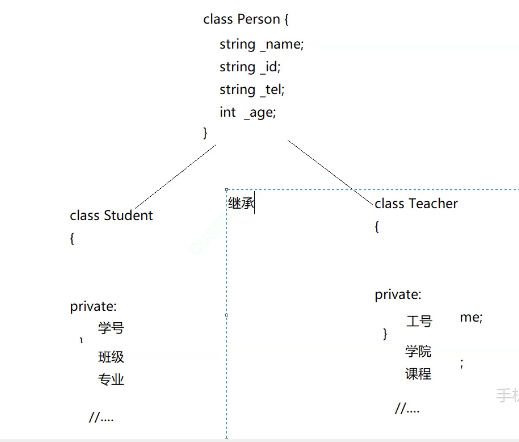
父类
 ||
子类（派生类）
**子类继承父类的成员变量和成员函数**

## 使用
```cpp
//     派生类  继承方式 基类
class Student :public Person
{


    public:
        int _stuid;
}
```

总结：
不管继承方式如何，父类的private成员在派生类中都不可见，根本不可用
基类的private成员在派生类中是不能被访问的，需要能够子啊派生类中就定义为protected
public>protected>private，因此，子类继承的权限仅能取小
几乎很少使用protected/private继承
class默认private继承，struct默认public继承


## 基类与派生类之间的赋值运算
```cpp
double i = 2.4;
int i = d;
const int& r = d;
//产生临时变量
Student s; 
Person p = s;
Person& rp = s;
//未产生临时对象
```
为什么不产生临时对象：
public继承，父类和子类是一个is-a的关系
子类对象赋值给父亲对象/父类指针/父类的引用
是天然的，不产生临时对象，这个叫做父子类赋值兼容规则（切割/切片）
**仅限于子类给父类**，因为就像切割内存一样，引用对象的地址指向的是子类
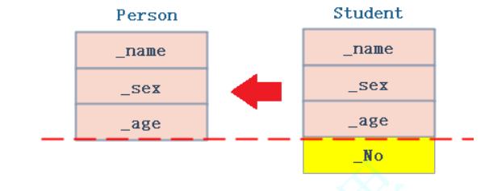

## 继承中的作用域
### 成员变量同名
父类和子类是有独立的作用域的，所以可以有同名成员。默认情况下是直接访问子类的。因为子类同名成员隐藏了父类的同名成员
如何区分：直接调用，基于就近原则，就会调用子类的
访问父类：指定作用域即可
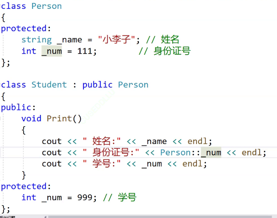

### 成员函数同名
两个函数会构成隐藏，函数重载的要求是在同一个作用域
调用父类大方法：指定作用域
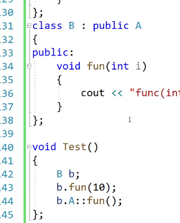

## 派生类的默认成员函数
1.子类没有父类成员的构造函数，编译器会自动调用父类的构造函数
2.若是在子类需要对父类成员进行构造，必须要调用父类的构造函数
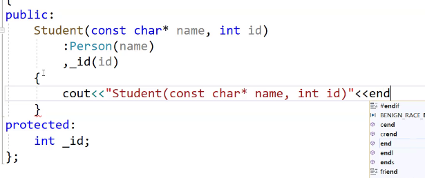
3.包括拷贝构造
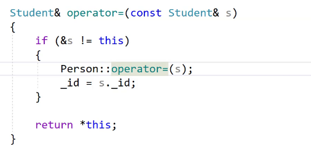
4.析构函数
无法调用父类析构函数，因为这两个析构函数构成隐藏关系，是由于多态 的原因，析构函数会同一处理成destructor
构造：先父后子，父先声明先定义，所以一定是先父后子
析构：先子后父，如果先将父亲析构，则有可能导致访问出现问题，存在风险，所以父类析构函数不需要显式调用，子类析构后会自动调用父类析构。

### 如何实现一个不能被继承的类
1.构造函数私有化
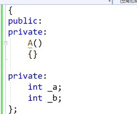
2.final字符
指定该类禁止继承

## 继承与友元
友元关系不能被继承


## 继承与静态成员
静态成员变量子类和基类使用的是同一个，继承的是使用权，但是没有继承独立的静态成员变量，这就和继承函数类似


## 菱形继承及菱形虚拟继承
单继承：只有一个直接父类
多继承：一个子类有多个直接父类
```cpp
class assistant:public student,public teacher
{

};
```
多继承可能会导致菱形继承

            class person
        /                      \
    class student           class teacher
        \                      /
            class assistant
会带来数据二义性以及数据冗余

### 虚拟继承解决数据冗余和二义性
指定访问
```cpp
class Teacher : virtual public Person//哪个基类可能有冗余就加在哪里
{};
```
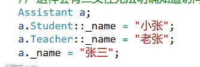


#### 原理->通过内存看
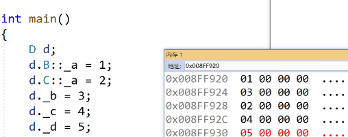
通过切片，对内存进行切割继承
虚继承：
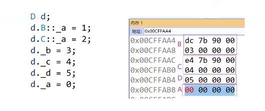
虚继承通过存储地址，指向一个空间，用一个表存储距离A的偏移量，然后在用原来的地址加上偏移量就是A的存储位置
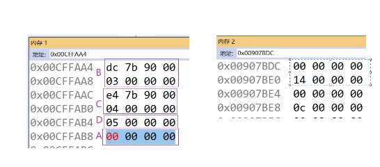
并且在虚继承的实例化类中也新增了一个指针，存下一个偏移量，这样的话，在存在菱形继承时，操作的同名变量都是同一个变量，并且偏移量表是共用的，因为每个类的实例化时的内存大小都是一致的，所以计算方法是一样的，所以用一个虚拟表比其在每个对象中实例化存储偏移量更节省内存
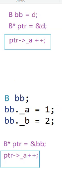
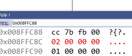

## 继承与组合
public继承是一个is-a的关系，每个派生类对象都有一个基类对象，父类的公有以及父类的保护都可以使用
组合式一种has-a的关系，假设B组合了A，每个B对象中都有一个A对象，组合类的公有可以使用，而组合类的私有不可以使用。
继承是一种白箱复用，基类的内部细节是可用的，而组合是一种黑箱复用，内部细节是不可见的。
**组合一般来说更好**：因为继承类与类之间耦合度很高，但是组合的类与类之间耦合度很低，依赖关系不高，关联度不高
