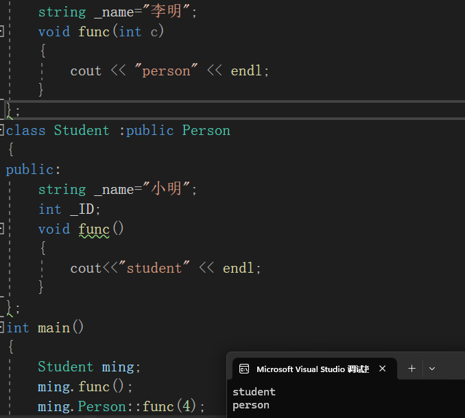

# C++之继承
继承是面向对象中很重要的思想之一，其本质是复用。
将多个类公共部分抽象出来写进一个新的类，让该类在其他类中继承。
**子类（派生类）继承父类的成员变量和成员函数**

## 使用
```cpp
class Person
{
public:
	int _age;
	int _gender;
};

class Student :public Person
{
public:
	int _ID;
};
```
### 继承方式
**此图是完整的继承方式以及对应的效果图**：

**理解**：
通过死记硬背的方式进行记忆该表是很难的，那么本质是什么呢？
派生类对基类成员的权限约束通过继承方式实现，继承方式的约束能力取决于成员权限与继承方式权限的大小关系。
举例来说，基类的private成员在派生类中无论如何都不可见，因为private权限是最高的，而基类public成员由于是最低权限，因此其成员权限完全和继承方式一致，受到继承方式权限约束。


### 基类与派生类之间的赋值关系
将子类对象赋值给父类是不会产生临时对象的，这里其实就是父子类赋值兼容规则，也就是所谓的切片原则，因为就如同切割内存一样，编译器可以直接将地址上内容进行整体移动


## 继承中的作用域
父类和子类是有独立的作用域的，所以可以有同名成员，默认情况由于就近原则会直接调用子类，但是可以通过指定作用域访问父类。
原因是子类同名成员隐藏了父类的同名成员
### 成员变量同名


### 成员函数同名
两个同名函数同样会构成隐藏，这里区别于函数重载，因为函数重载要求在同一个作用域。


## 派生类的默认成员函数
1.子类没有父类成员的构造函数，编译器会自动调用父类的构造函数；
2.若在子类需要对父类成员进行构造，必须显式调用父类的构造函数；
3.拷贝构造同以上两点；
4.析构函数
析构函数无法调用父类析构函数，因为这两个析构函数构成隐藏关系（虽然我们看到的是不同名称的析构函数，但其实析构函数具有多态的性质，会被编译器处理成同名destructor），编译器会将在子类析构后，自动调用父类析构，所以也不需要我们显式调用。

## 继承与友元&静态成员
1.友元关系不能够被继承；
2.子类和基类使用的是同一个静态成员变量，基类继承给子类的是使用权，但是没有让子类继承独立的静态成员变量。

## 菱形继承
单继承：只有一个直接父类；
多继承：有多个直接父类
**多继承可能导致菱形继承**：
现在假设有一类特殊人群，既是母亲，又是老师，呈现以下关系：

用代码表示：
```cpp
#include<iostream>
#include<string>
using namespace std;
class Person
{
public:
	int work_of_num;
};

class Mother:public Person
{
public:
	int sex_of_child;
};

class Teacher:public Person
{
public:
	int rank;//教育等级
};

class SomePeople:public Mother,public Teacher
{
public:
	int bonus;
};
```
但是这里当我们想调用时却会存在问题：

这是由于多继承导致的**数据二义性**，这我们可以通过指定访问解决：

但是这里又会导致一个新的问题：**数据冗余**

为了解决这个问题我们引入虚继承：
```cpp
class Mother:virtual public Person
{
public:
	int sex_of_child;
};

class Teacher:virtual public Person
{
public:
	int rank;//教育等级
};
```

通过这里的内存我们可以发现虚继承之后在原有的类上存储了一张表，记录了对应的变量地址偏移量。偏移量表是共用的，每个类的实例化时的内存大小都是一致的，所以计算方法是一样的，因此用虚拟表记录比每个对象中实例化存储偏移量更节省内存.
在实际工程问题中我们应尽量避免写出菱形继承，实在存在，我们应该用虚拟继承解决菱形继承带来的数据冗余和二义性问题


## 继承与组合
继承表达的是"是一个（is-a）"的关系，而组合表达的是"有一个（has-a）"的关系。组合通常更灵活，降低了类之间的耦合度，推荐在需要较低依赖关系的情况下使用组合而不是继承。